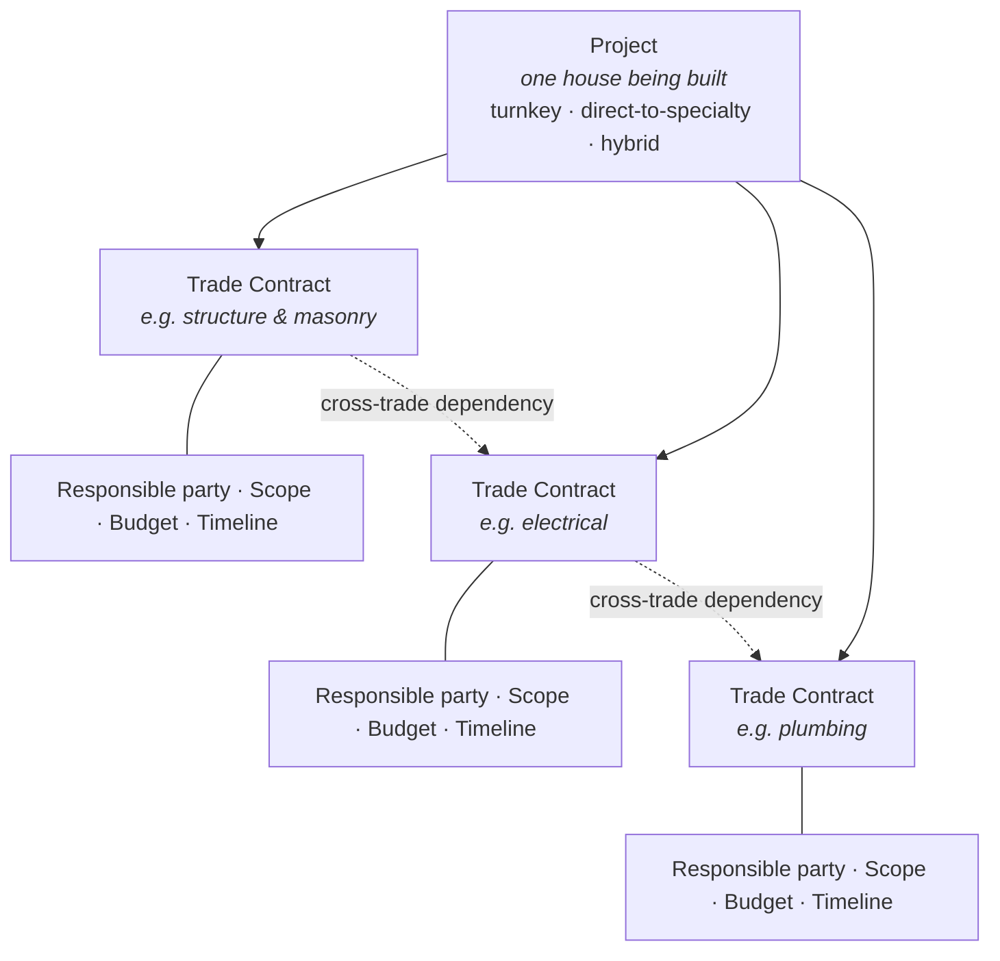

# Operating models and the Trade Contract

This is the structural document. The distinction below is not a market
segmentation exercise — it changes what the product has to be, and it is
the reason a single concept, the **Trade Contract**, sits underneath
everything else.

## Three ways a house gets built

**Turnkey.** The owner signs with one contractor, who subcontracts and
coordinates every specialty underneath their own contract. The owner has
one relationship to manage, and a certain amount of trust is already
implied by hiring a full contractor.

**Direct-to-specialty.** The owner contracts each specialty separately —
mason, electrician, plumber, carpenter, roofer, tiler, painter — with no
general contractor in between. The owner *is* the coordinator, whether
they intended to take on that job or not. This is common, not an edge
case.

**Hybrid.** A contractor handles structure and masonry; the owner hires
the electrician and plumber directly to save the general contractor's
markup; everyone assumes somebody else is tracking how the pieces fit
together. In practice this is probably the most common of the three.

## Why the second model matters more than it looks

The direct-to-specialty model does not just add complexity. It makes the
shared record **more** valuable, not less.

In the turnkey model there is one relationship and some inherited trust.
In the direct model the owner coordinates several independent parties who
likely do not know each other, have no shared history, and where no
single party is accountable for how the pieces interlock. That is a
harder coordination problem — and it is exactly the problem a shared
record solves best, because there is no default trust to fall back on
between strangers under separate contracts.

## Four risks that exist only here

Each one drives features in
[05-functional-scope.md](./05-functional-scope.md).

**Scope gaps between trades.** If nobody's contract explicitly covers
"who seals around the window frame," it falls through the crack between
the mason and the window installer. This dispute literally cannot happen
on a single-contractor build, where everything is by definition one
party's problem.

**Cash-flow coordination.** A general contractor usually smooths payment
timing internally. An owner juggling six separate payment schedules
against six separate completion milestones has a real planning problem
that the turnkey model hides from them entirely.

**Cross-trade safety coordination.** Multiple independent crews on site
at once, with nobody centrally responsible for how their work overlaps,
is a materially different safety picture from one contractor's crew.

**Sequencing disputes between trades.** *"You should have finished
before I started"* is an argument between two subcontractors, not between
owner and contractor. Any framing that assumes the dispute is always
owner-versus-builder misses this entirely — and it is common.

## The Trade Contract

One first-class concept serves all three models without forcing a fake
general contractor into the picture.

A **Trade Contract** is a scoped agreement for one specialty, with its
own responsible party, scope document, budget and timeline, rolling up
into one master project view.

**Cardinality follows reality.** A pure turnkey project has one Trade
Contract covering everything, held by the general contractor. A fully
disaggregated project has one per specialty, each tied directly to the
owner. A hybrid project has however many the owner actually signed. The
product does not ask which model this build is; it just holds as many
Trade Contracts as exist.

**The responsible party is not a fixed role.** It can be a general
contractor holding several Trade Contracts in one project, or a specialty
subcontractor engaged directly by the owner. A "subcontractor" in the
direct model is the owner's counterparty, not somebody's subordinate —
which is why roles are named after the people who exist on a real build
rather than forced into an owner/contractor/admin triad.

**Everything rolls up.** Time, money and scope aggregate from every Trade
Contract into one project-level view. Disaggregating the contracts must
not disaggregate the owner's picture of their own house.

## What follows from this

The Trade Contract is the atomic unit of scope, and therefore the unit
that change orders, payment milestones, budgets, timelines and history
attach to. When something in this documentation is described "per
contract" rather than "per project," this is why.

It also happens to be the breakdown a BIM model organizes itself around —
structural, electrical, plumbing, finishes. That is a convenience, not a
justification; the concept earns its place on the coordination argument
alone.
