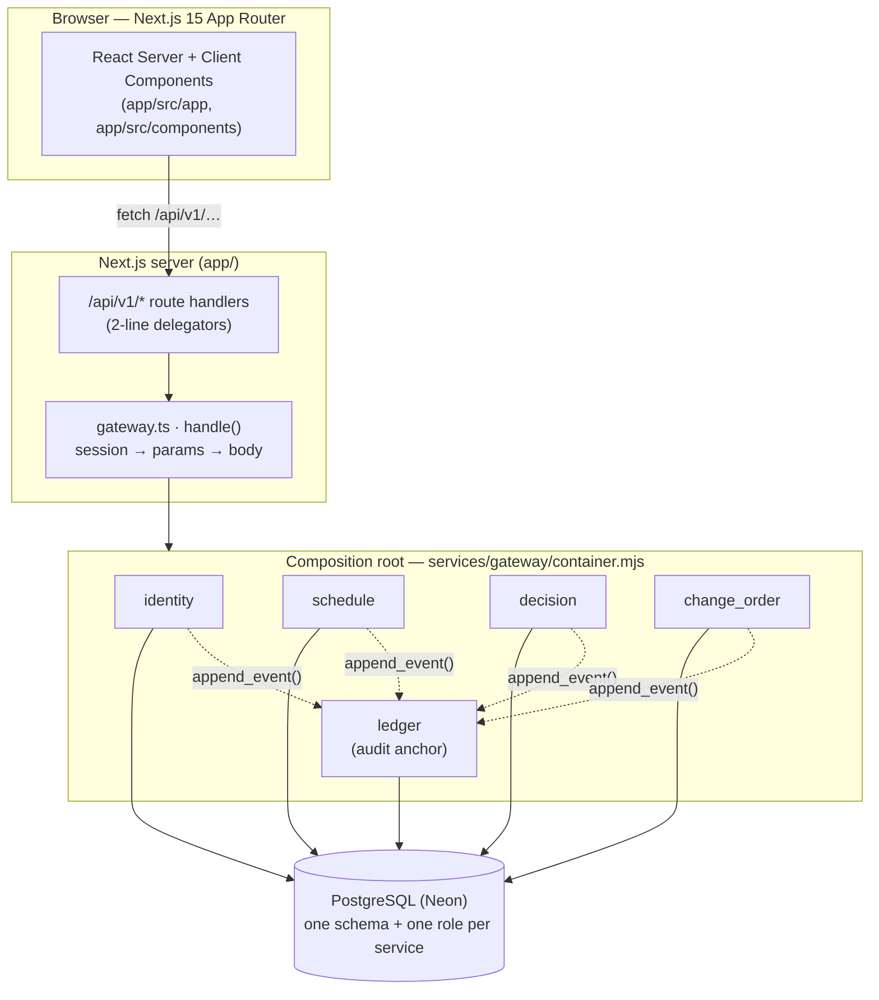

# LinkNMS — Architecture Documentation

> **Audience.** Anyone who needs to understand *what the platform does and how it
> does it* — the founder, a new engineer on day one, or a reviewer checking that
> the code still matches the design.
>
> **Owner.** Full-Stack Architect. Kept in sync with the code; when the code and
> a diagram disagree, the code wins and the diagram is a bug — tell the owner.

This set is **diagram-first**. Every page opens with a picture you can read
top-to-bottom, then the prose underneath explains the parts and points at the
exact files.

## The three documents

| # | Document | Answers |
|---|----------|---------|
| 1 | [System architecture](01-system-architecture.md) | What are the moving parts (services, database, front end), how are they wired, and what happens on one request? |
| 2 | [Data model](02-data-model.md) | What is stored, in which schema, and how is the **tamper-evident audit trail** — the core promise of the product — actually built? |
| 3 | [The task API & state machines](03-tasks-api-and-state-machines.md) | Every concept attached to a task (assignee, status, specialty, dates, description, hierarchy, documents), the API that owns each, and how state is managed **by explicit state machines, never by loose strings**. |

## The one-paragraph version

LinkNMS is a **collaboration platform for building a house**. It connects the
homeowner with every party doing or managing the work (general contractor,
subcontractors, site manager, architect, inspectors) around **one shared
record** of what was agreed, what changed, and what it cost. The product exists
for the moment a build goes sideways — *"who decided this, when, and how much did
it move the budget?"* — and turns that from an argument into a lookup. That is
why the **auditable decision log** (attributable, time-stamped, hash-chained) is
a first-class part of the architecture, not a bolt-on.

## The shape of the system, in one picture



Every state-changing call writes its domain row **and** a mirrored, hash-chained
`ledger.audit_event` in the *same database transaction*: if the audit entry does
not land, the change did not happen. That single rule is what makes the record
trustworthy. See [document 2](02-data-model.md#the-audit-ledger) for how the
chain is built.

## Conventions used across these docs

- **"Build" = "project".** There is no separate builds table; a build *is* a row
  in `identity.project` (ADR-0011). The two words are used interchangeably.
- **"Task" = "stage".** The WBS work item is a row in `schedule.stage`. The UI
  calls it a task; the schema calls it a stage.
- **File references** are repo-relative and clickable, e.g.
  `services/schedule/schedule.mjs`.
- **ADR references** point at `docs/architecture/adr/`.
```
