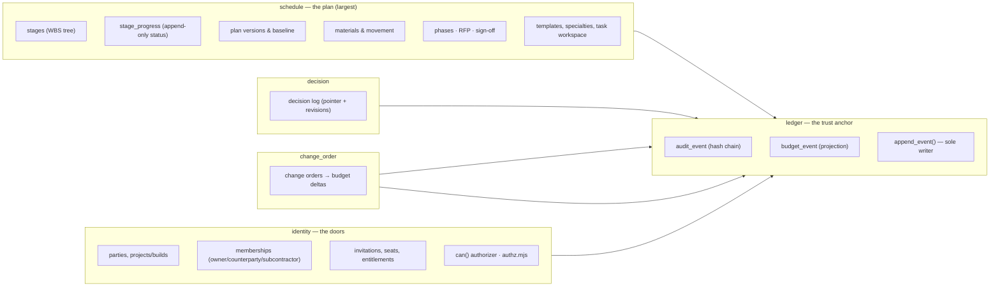
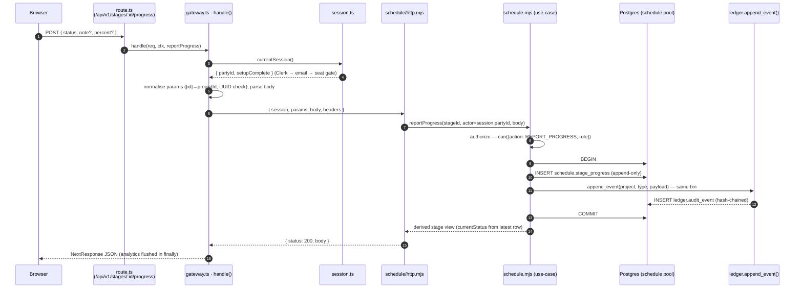
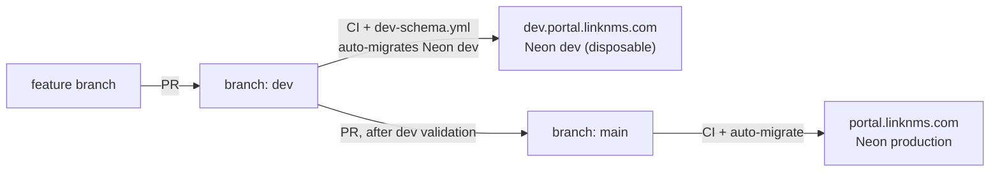

# 1 · System architecture

How the moving parts fit together and what happens on a single request.

## 1.1 The stack

| Layer | Choice | Where |
|-------|--------|-------|
| Front end | Next.js 15 (App Router, React Server + Client Components) | `app/` |
| API transport | Next route handlers under `app/src/app/api/v1/**` | each ~2 lines |
| Domain logic | Framework-agnostic `.mjs` services (JSDoc-typed, `allowJs`) | `services/` |
| Data | PostgreSQL (Neon), **one schema + one least-privilege role per service** | `services/<svc>/migrations`, `db/` |
| Auth | Clerk (session + org), mirrored into an in-DB RBAC catalog | `services/identity`, `app/src/server/session.ts` |
| Object storage | Cloudflare R2 (S3 API) for task attachments | ADR-0021 |
| Analytics | PostHog sink, flushed per request | `services/analytics` |
| Delivery | `dev` → dev.portal.linknms.com, `main` → portal.linknms.com | ADR-0022 |

The guiding decision (ADR-0003, ADR-0006): **domain logic never imports Next**.
Services take plain ports (`store`, `ledger`, `identity`) and return
`{status, body}`. The Next side is a thin adapter. This keeps the trust rules
(audit, authorization, freeze) testable without a browser and swappable behind
either an in-process or HTTP transport.

## 1.2 The services

Each service owns exactly one Postgres schema and one DB role (`<svc>_app`) with
least privilege — e.g. `schedule_app` can `INSERT`/`SELECT` on `stage_progress`
but has no `UPDATE`/`DELETE`, because progress is append-only.



| Service | Responsibility | Entry point |
|---------|----------------|-------------|
| **ledger** | The tamper-evident hash chain (`audit_event`) + budget projection (`budget_event`). Only writer is `ledger.append_event()` (SECURITY DEFINER). | `services/ledger/http.mjs` |
| **identity** | Parties, projects/builds, memberships, invitations, seats, entitlements, profile, and the `can()` authorizer. | `services/identity/http.mjs`, `authz.mjs` |
| **schedule** | The plan and everything on it: stages, progress, versioning/baseline, materials, import, templates, task workspace, specialties, phases, RFP, sign-off. | `services/schedule/http.mjs` |
| **decision** | The decision log: a current-state pointer plus append-only revisions. | `services/decision/http.mjs` |
| **change_order** | Change orders (propose → approve/reject); only `cost_delta_cents` reaches the budget. | `services/change_order/http.mjs` |
| **analytics / email** | Cross-cutting sinks, injected at the root. | `services/analytics`, `services/email` |

> **Note.** There is no separate `procurement` or `sign-off` service — phases,
> RFP and execution sign-off all live *inside* the `schedule` schema (ADR-0023).

## 1.3 Composition — how they are wired

Everything is assembled once, lazily, in `services/gateway/container.mjs`
(`getContainer()` is a memoised singleton):

1. `createContainer({urls, roles, analytics})` builds **one `pg` pool per service
   role** (`SCHEDULE_DATABASE_URL`, `IDENTITY_DATABASE_URL`, … falling back to
   `DATABASE_URL`). This is ADR-0006 least-privilege isolation made physical.
2. A shared ledger cache; one `createPgLedger({pool, cache})` binding **per
   service pool**, so an `append_event` lands inside the *same* transaction as
   the domain write it accompanies.
3. `createServices({...})` (`services/composition.mjs`) builds the object graph —
   the same function the composition tests use.
4. Two notable orchestrations at the root:
   - **Project → phases.** After `identity.createProject`, the container seeds
     the `procurement`/`execution` phases (`phases.ensurePhases()`, idempotent —
     ADR-0023 §3).
   - **Portfolio counts.** identity is handed `counts.decisions` /
     `counts.changeOrders` callbacks so it can show per-build counts *without*
     ever reading a sibling service's schema.

The Next side re-exports the container through `app/src/server/gateway.ts`:
`container()` returns the singleton, and every route handler is a two-line
delegator, e.g.:

```ts
// app/src/app/api/v1/stages/[stageId]/progress/route.ts
export function POST(req, ctx) {
  return handle(req, ctx, (c) => container().http.schedule.reportProgress(c));
}
```

## 1.4 The request lifecycle

One request, end to end — using "append task progress" as the example:



Key properties visible here:

- **The actor is derived from the verified session, never from the body.** A
  client cannot report progress *as* someone else.
- **Authorization is a pure function** (`can()`), evaluated before any write.
- **The domain write and the audit entry share one transaction.** Either both
  land or neither does (ADR-0002).
- **Status is *returned* as a derived value**, read off the latest append-only
  progress row — it is never a column that got overwritten.

## 1.5 The colon-action route convention

Some actions are verbs on a noun, e.g. "confirm this import", "swap this
material", "accept this plan version". Rather than inventing sibling routes, the
verb rides the last path segment after a colon:

```
POST /api/v1/projects/:id/plan-imports:confirm
POST /api/v1/stages/:id/materials:swap
POST /api/v1/projects/:id/plan-versions/{versionId}:accept
```

Because a Next dynamic segment must be a whole segment, a single
`[versionAction]` route splits on the **last** `:` (UUIDs contain none),
validates the UUID, and dispatches through an `ACTIONS` map (404 on an unknown
verb). See `app/src/app/api/v1/projects/[id]/plan-versions/[versionAction]/route.ts`.

## 1.6 Deployment

Two pipelines, keyed by branch (ADR-0022):



Feature branches PR into `dev` first, are validated on the dev environment, then
`dev` → `main` ships to production. CI and quality gates run on **all** PRs. An
applied migration is **immutable** — a byte-checksum guard halts every prod
migrate if a committed migration file changes, even a comment.
