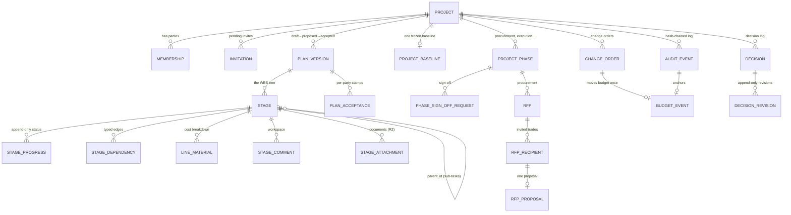
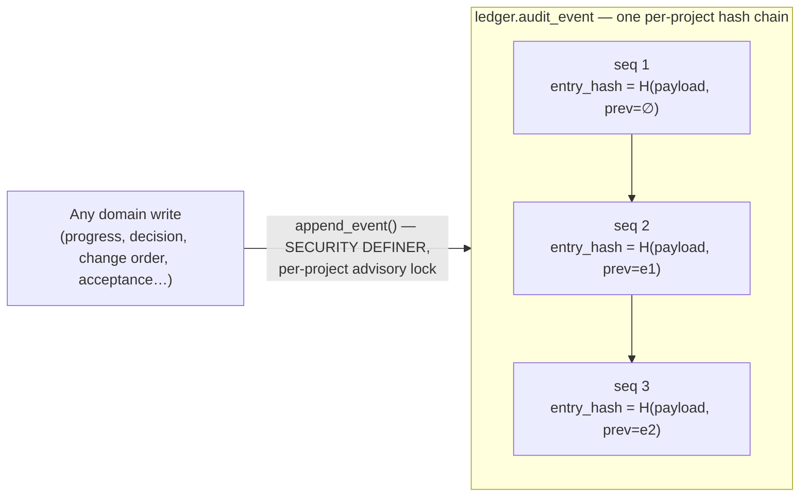

# 2 · Data model

What is stored, in which schema, and how the tamper-evident audit trail is built.

Each service owns one Postgres schema. Nothing has a cross-schema foreign key —
references across services are **bare id columns**, validated in code through a
port (e.g. `assignee_party_id` is checked against identity at author time, not by
an FK). That is what lets each schema migrate and be granted independently
(ADR-0006).

## 2.1 The map, one build's worth of data

The tables cluster into three concerns, described below: **the doors**
(identity), **the plan** (schedule), and **the record of decisions and money**
(ledger + decision + change_order).

## 2.2 The doors — `identity`

| Table | Purpose | Notable columns / rules |
|-------|---------|-------------------------|
| `party` | A person or org in the system. | `email UNIQUE`, `external_id` (Clerk), domain `role IN (owner, contractor, viewer)`. |
| `project` | **The build.** | `owner_party_id` (nullable — stamped on owner accept, ADR-0016), `operating_model IN (turnkey, direct, hybrid)`, `status IN (draft, active)`. |
| `membership` | Who is on a build and in what capacity. **This is the authorization-bearing role.** | `role IN (owner, counterparty, subcontractor)`; `UNIQUE(project_id, role)`, `UNIQUE(project_id, party_id)`. |
| `invitation` | A pending seat at a build. | `token_hash` (SHA-256), `role IN (counterparty, subcontractor)`, `status IN (pending, accepted)`. |
| `seat`, `entitlement` | Who is allowed through the door and how many builds a seat may run. | founding seats hard-capped at 50 by trigger (ADR-0008/0013). |
| RBAC catalog (`users`, `orgs`, `roles`, `permissions`, `role_permissions`, `memberships`, `resource_acls`) | The Clerk mirror the `can()` authorizer reads. | `resource_acls.effect IN (allow, deny)`, **deny wins** (per-resource scoping, ADR-0010). |

> ⚠️ **Two different "role" enums exist** and it matters: `party.role`
> (owner/contractor/viewer) is a coarse domain label; **`membership.role`**
> (owner/counterparty/subcontractor) is the one authorization is computed from.
> When you read "role" in the authz path, it is the membership role.

## 2.3 The plan — `schedule`

This is the largest schema. Its heart is the **stage** (the task) and the
**append-only progress** attached to it. Full task detail is in
[document 3](03-tasks-api-and-state-machines.md); the storage shape:

| Table | Purpose | Notable columns / rules |
|-------|---------|-------------------------|
| `stage` | **A task in the WBS.** | `parent_id` (self-ref, hierarchy), `position`, `key` (stable client-minted identity), `trade`, `assignee_party_id`, `description`, `scope_note`, `planned_start_date`, `planned_end_date`, `planned_cost_cents`, `plan_version_id`. **No status column, by design.** |
| `stage_progress` | **Append-only status history.** The stage's current status is the latest row. | `status IN (not_started, in_progress, blocked, done)`, `percent` (0–100, only when `in_progress`), `note`, `reported_by_party_id`, `reported_at`, `stage_key`. **SELECT/INSERT only — no UPDATE/DELETE.** |
| `stage_dependency` | Typed edges between tasks. | `dep_type IN (starts_after, starts_with, ends_with)` (FS/SS/FF, ADR-0020); no self-dependency. |
| `plan_version` | A draft/proposed/accepted version of the whole plan. | `status IN (draft, proposed, withdrawn, rejected, superseded, accepted)`, `version_no` (null while draft), `frozen_at` (iff accepted). One open proposal, one draft, per project (partial unique indexes). |
| `plan_acceptance` | Per-party acceptance stamps. | `kind IN (proposed, accepted)`, `UNIQUE(plan_version_id, party_id)`. Append-only. |
| `project_baseline` | The one frozen baseline for a build. | `project_id` PK → `plan_version_id`. |
| `line_material`, `material_movement` | The cost breakdown behind a task and how it moves. | movement `kind IN (scope_change, price_movement)`; a CHECK forbids blurring the two (ADR-0014). |
| `plan_import`, `plan_template`, `specialty` | Import batches, editable scaffolds, and the trade suggest-catalog. | templates have no ledger seam (ADR-0018); specialty does **not** replace the free-form `stage.trade`. |
| `stage_comment`, `stage_attachment` | The task workspace. | anchored on `(project_id, stage_key)`; attachment bytes in Cloudflare R2 (ADR-0021), 10 MB cap. |
| `project_phase`, `phase_sign_off_request`, `rfp`, `rfp_recipient`, `rfp_proposal`, `plan_change_log` | Phases, procurement RFPs, execution sign-off, and the pre-sign-off change trail. | phase `signed_off` is one-way (trigger); sign-off cannot be self-approved. |

**Freeze enforcement.** Once a plan version is accepted (or superseded /
withdrawn / rejected), database triggers reject any INSERT/UPDATE/DELETE of its
stages and materials (`stage_freeze_guard`, `line_material_freeze_guard`). After
the baseline, the only way a number changes is a **change order** or a recorded
**material movement** — never a quiet edit.

## 2.4 The record of decisions and money

| Table | Schema | Purpose |
|-------|--------|---------|
| `decision` / `decision_revision` | `decision` | A decision is a mutable pointer to its latest revision; revisions are **append-only** (`UNIQUE(decision_id, rev)`, no UPDATE/DELETE grant). |
| `change_order` | `change_order` | `status IN (proposed, approved, rejected)`, signed `cost_delta_cents`. CHECKs enforce *no self-decide* (`decided_by <> proposed_by`) and field consistency by status. |
| `budget_event` | `ledger` | The **only** thing that moves the budget. `UNIQUE(change_order_id)` — a change order moves the budget once, ever. |

## 2.5 The audit ledger

This is the product's reason to exist, so it gets its own section.

The mechanics:

- **One writer.** `ledger.append_event(...)` is `SECURITY DEFINER` and is the
  *only* code path that can insert an `audit_event`. No service role holds raw
  INSERT/UPDATE/DELETE on the table.
- **Per-project monotonic `seq`** under a `pg_advisory_xact_lock`, so two
  concurrent writes to the same build can never interleave a gap or a duplicate.
- **Hash chain.** Each row stores `payload_hash`, `prev_hash` (the previous
  row's `entry_hash`), and its own `entry_hash`. Tampering with any historical
  payload breaks every `entry_hash` after it — the chain is verifiable end to
  end. `UNIQUE(project_id, entry_hash)` and `UNIQUE(project_id, seq)` back it up.
- **Same-transaction coupling.** Because the ledger binding uses the *same* pool
  and transaction as the domain write, "the change happened" and "the change is
  in the log" are the same commit. There is no window where one exists without
  the other (ADR-0002).
- **Budget is a projection.** `budget_event` rows are derived from approved
  change orders and anchored to their `audit_event`; the budget is never a
  free-floating number someone can edit.

This is why the answer to *"who decided this, when, and how much did it move the
budget?"* is a **lookup, not an argument** — every state change is an
attributable, time-stamped, tamper-evident row on one chain.

## 2.6 Migrations & environments

- Migrations live per service under `services/<svc>/migrations/*.sql`, plus a
  platform bootstrap in `db/` that creates the schemas and roles.
- `platform.schema_migrations` records each applied file with a **byte
  checksum**. Editing an already-applied migration (even a comment) halts every
  future migrate — always add a new forward migration (ADR-0022 delivery norm).
- `dev` auto-migrates the disposable Neon dev branch; `main` migrates
  production. Validate on dev first.
