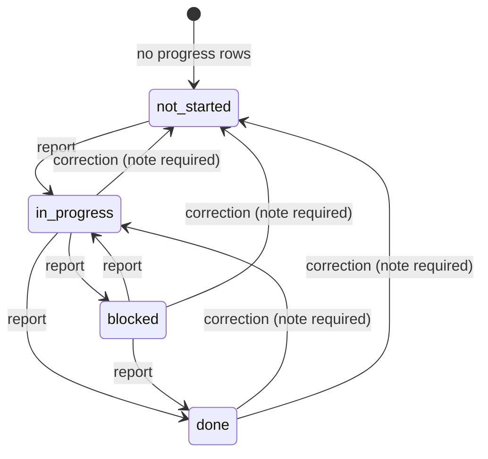
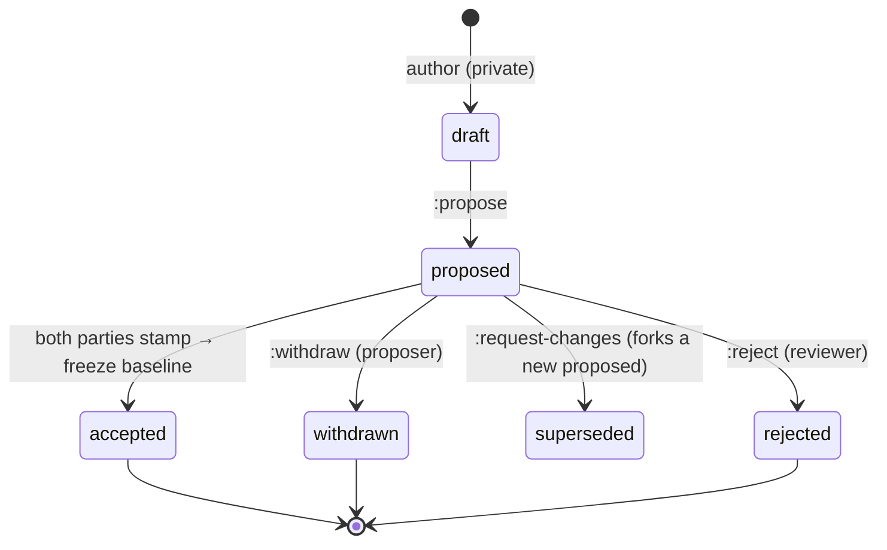
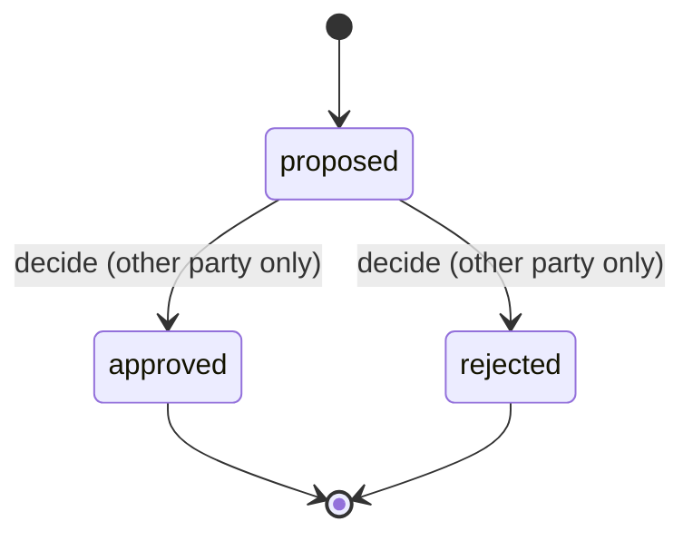
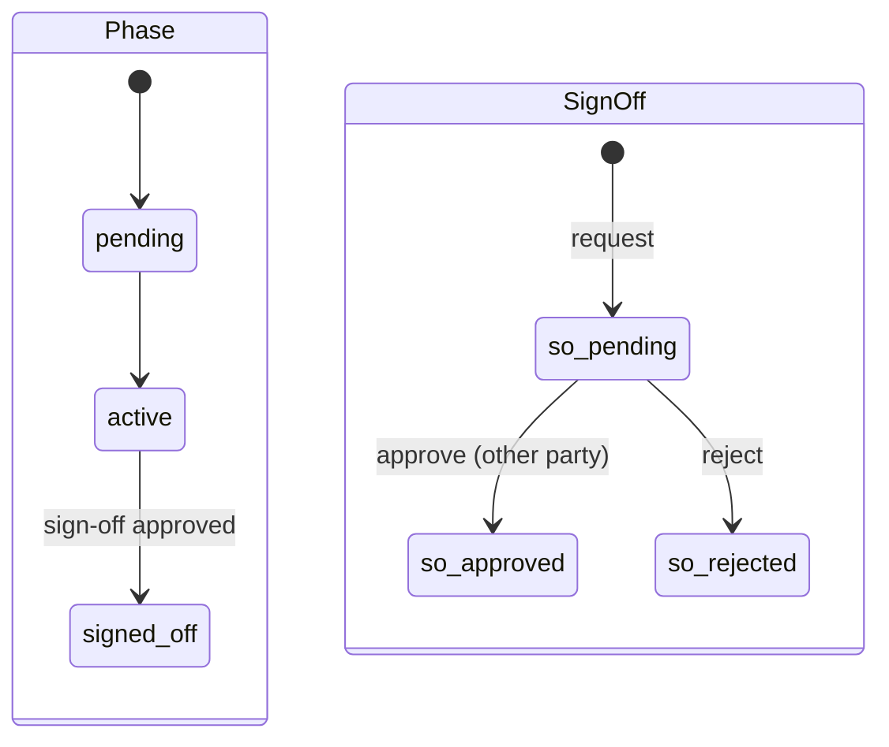

# 3 · The task API & state machines

Every concept attached to a task, the API that owns it, and how state is managed
by **explicit state machines** — not by loose strings in the database.

## 3.1 What a "task" is

In the UI it is a **task**; in the schema it is a `schedule.stage` row. One task
carries every concept below. Each concept has exactly one owning API surface — a
concept is never edited two different ways.

| Concept | Wire field | Storage | How it is set | State-managed? |
|---------|-----------|---------|---------------|----------------|
| Identity (stable) | `key` | `stage.key` (client-minted, ≤200 chars) | Minted once by the author; **survives re-saves that re-mint the row `id`**. | — |
| Identity (row) | `id` | `stage.id` (uuid) | Server-minted; **re-minted on each draft save** — never use it as a durable address. | — |
| Title | `name` | `stage.name` | Plan authoring (`:author`) or `PATCH /stages/:id`. | — |
| Hierarchy | `parent_id`, `children[]`, `position` | `stage.parent_id`, `stage.position` | Plan authoring; up to 3 levels (Phase → Task → Sub-task, ADR-0019). | — |
| Assignee | `assigneePartyId` | `stage.assignee_party_id` | Plan authoring (`setAssignee`); validated against membership at author time. | — |
| **Status** | `currentStatus` | **derived from `stage_progress`** (no column) | `POST /stages/:id/progress` (append-only). | ✅ state machine |
| Specialty / trade | `trade` | `stage.trade` (free text) | Plan authoring; `GET /specialties` is only a suggest-catalog. | — |
| Description | `description` (+ `scope_note`) | `stage.description`, `stage.scope_note` | Plan authoring / task drawer. | — |
| Dates | `plannedStartDate`, `plannedEndDate` | `stage.planned_*_date` | Plan authoring / Gantt drag. | — |
| Cost | `plannedCostCents` | `stage.planned_cost_cents` | Plan authoring; frozen at baseline, then moves only via change order / material movement. | — |
| Dependencies | `dependencies[] {on, type}` (+ legacy `dependsOn[]`) | `stage_dependency` | Plan authoring; `type IN (starts_after, starts_with, ends_with)`. | — |
| Documents | attachments | `stage_attachment` (R2 bytes) | `POST …/stages/:key/attachments`. | — |
| Comments | comments | `stage_comment` | `POST …/stages/:key/comments`. | — |

Two identities per task, and the difference is load-bearing:

- **`key`** is the durable address (used by the task permalink
  `/plan/tasks/:stageKey`, by comments, attachments, and progress history).
- **`id`** is the current database row, which is **re-minted every time a draft
  is saved**. Anything durable must key off `key`, never `id`. (This is the root
  cause of the class of "404 on a stale id" bugs — see §3.6.)

## 3.2 The task API surface

Read the whole plan, then act on individual tasks.

### Read

```
GET /api/v1/projects/:projectId/plan
```
Returns `{ baseline, current, history }`. `current.stages` is the WBS tree; each
node carries every field in §3.1, with `currentStatus` derived from the
append-only progress history. Handler: `schedule.getPlan` →
`services/schedule/plan-version.mjs`.

```
GET /api/v1/stages/:stageId
GET /api/v1/projects/:projectId/plan/stages/:stageKey/workspace
```
One task with its full attributed progress history / its comments + attachments.

### Author the plan (the tree, in one write)

```
POST /api/v1/projects/:projectId/plan-versions:author
```
The single write that persists the whole draft tree (names, hierarchy,
assignees, trades, descriptions, dates, dependencies). **Returns a `stageIds`
map of `key → id`** so the client can address the freshly-minted rows. Handler:
`schedule.authorPlan`. Authoring is a *private draft* until proposed.

### Act on one task

```
POST   /api/v1/stages/:stageId/progress        # append a status report
PATCH  /api/v1/stages/:stageId                 # edit/reorder a single stage (GC)
POST   /api/v1/projects/:id/plan/stages/:key/comments
POST   /api/v1/projects/:id/plan/stages/:key/attachments
GET    /api/v1/specialties                      # trade suggest-catalog
```

### Progress request/response

```
POST /api/v1/stages/:stageId/progress
{ "status": "in_progress", "percent": 40, "note": "framing started" }

200 → the stage view with currentStatus + full history
403 → not permitted to report on this build (typed)
400 → invalid_status | note_required (walking back to not_started) | invalid_percent
404 → stage not found (see §3.6)
```

Rules the endpoint enforces (`services/schedule/schedule.mjs` `reportProgress`):

- `status` must be one of the four enum values.
- `percent` is meaningful **only** while `in_progress`; ignored otherwise, so a
  report can never read "done · 70%".
- Walking **back** to `not_started` from any other status **requires a note** —
  a correction must say why.
- Either project party may report (LINA-306); the server authorizes from the
  session (`REPORT_PROGRESS`) and returns a typed 403 on refusal.

## 3.3 The state machines

State in LinkNMS is managed by **explicit, guarded transitions in the service
layer**, each mirrored by one append-only ledger event. The four aggregates that
have a lifecycle:

### Task status (derived, append-only)



The current status is **the status of the latest `stage_progress` row**, ordered
by `(reported_at, seq)`, anchored on the stable `stage_key`. There is **no status
column to overwrite** — a "transition" is literally appending a new attributed
row. See §3.5 for why this is the strongest possible design here.

### Plan version


Guards in `services/schedule/plan-version.mjs`: a non-`proposed` version rejects
`:withdraw`/`:accept`/`:reject` with `409 not_proposed`. Freeze (→ `accepted` +
`frozen_at`) happens on the **second** acceptance stamp (proposer *proposed* +
reviewer *accepted*).

### Change order


Guards (`services/change_order/change-order.mjs`): `409 already_decided` when not
`proposed`; `403 self_decision` when decider = proposer; idempotent replay via
`decision_idempotency_key`. The DB independently enforces `decided_by <>
proposed_by`. Only an **approved** change order writes a `budget_event`.

### Phase & sign-off


`signed_off` is **one-way** (DB trigger `reject_phase_signed_off_reopen`).
Sign-off cannot be self-approved (`403 cannot_self_approve`), needs an active
phase with tasks, and allows only one pending request per phase.

### Where authorization lives

Every transition above first passes the pure `can()` authorizer
(`services/identity/authz.mjs`): a frozen `ACTION` enum, role→capability sets for
`owner`/`counterparty`/`subcontractor`, deny-by-default, and a two-sided rule
(actor ≠ proposer) for `REVIEW_PLAN` and `DECIDE_CHANGE_ORDER`.

## 3.4 "The database should not manage state with strings" — where we stand

This is the founder's design challenge, taken head-on.

**What the database actually does.** The status labels (`not_started`,
`proposed`, `approved`, …) are stored as `text` **constrained by `CHECK`
enums**. A CHECK enum is a *type* — a closed set — not "managing state with
strings". It is the database refusing to store a value the domain never defined.
Removing it would make the store *less* safe, not more.

**Where state is actually managed.** The *rules* — which transitions are legal,
who may perform them, what must accompany them — live in the **service layer** as
explicit guards, and every transition is mirrored into the append-only,
hash-chained ledger in the same transaction. That is the state machine. The DB
enum and the code guard are two independent nets under the same wire.

**Two honest gaps, and the plan for each:**

1. **Transitions are scattered, not declared.** Today the plan-version,
   change-order and phase transitions are enforced by ad-hoc comparisons
   (`if (status !== 'proposed') throw 409`). They are correct but not *legible in
   one place*. **Improvement (proposed):** lift each aggregate's legal
   transitions into a single declared **transition table** in code — e.g.
   `PLAN_VERSION_TRANSITIONS = { proposed: ['withdrawn','rejected','superseded','accepted'], … }`
   — and route every write through one `transition(aggregate, from, action)`
   function that is unit-tested exhaustively. **No schema change**: the labels
   stay constrained enums; only the *decision of which move is legal* moves from
   scattered `if`s into one named machine. This is the "state machine, not
   strings" answer for these three aggregates.
2. **Duplicate ADR-0019 number** and an `openapi.yaml` stub — housekeeping,
   tracked in §3.6.

**Where the design is already stronger than a state-machine column.** Task
**status is not a column at all** — it is derived from an append-only history
(see §3.5). A conventional `status` column with a state-machine library would be
*weaker* here: it would be overwritten in place, losing attribution and
tamper-evidence, which is the one thing this product cannot lose.

## 3.5 Why task status is derived, not stored

This is deliberate (ADR-0019) and worth defending explicitly, because it looks
unusual next to the other aggregates:

- **Attribution.** Every status change is a row that records *who* reported it,
  *when*, and *with what note/percent*. "The task went to blocked" is never a
  fact without a name and a timestamp attached.
- **Tamper-evidence.** The history is append-only (no UPDATE/DELETE grant) and
  each report is mirrored to the hash-chained ledger. You cannot rewrite what a
  task's status *was* on a given date — exactly the property a build dispute
  needs.
- **No lost corrections.** Walking a status back is a new, note-bearing row, not
  an overwrite — the earlier claim stays visible in the record.
- **Derivation is cheap and total.** Current status = latest row, or
  `not_started` when there are none. One read per plan covers the whole tree.

The cost is that "current status" is computed, not selected — accepted, because
the product *is* the auditable history, and a stored column would be a second,
un-auditable source of truth.

## 3.6 Known sharp edges (for maintainers)

- **Stale `stage.id` → 404.** `id` re-mints on every draft save; anything durable
  must address a task by `key`. A client holding an old `id` and calling
  `POST /stages/:id/progress` gets a `404 not_found`. The progress endpoint
  should resolve the stage by `(project_id, stage_key)` when a raw-id lookup
  misses — tracked under LINA-306. Until then, the FE must refresh its
  `key → id` map from every `:author` response (`result.stageIds`).
- **Two "role" enums** — always confirm you mean `membership.role` in the authz
  path (§2.2).
- **`app/openapi.yaml` is a stub** — the authoritative surface is the route files
  under `app/src/app/api/v1/**` plus the per-service `openapi.yaml` fragments.
- **Duplicate ADR-0019 number** (`…task-types-and-wbs-depth` and
  `…task-detail-drawer`) — renumber one on the next ADR touch.
