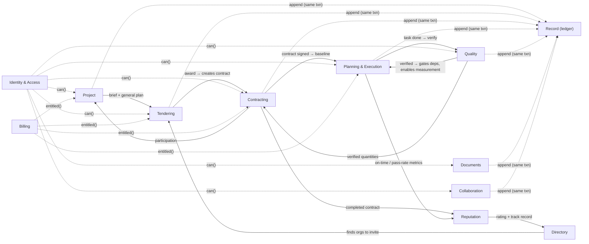

# 02 — Domain map

Twelve bounded contexts in one **modular monolith**. Each module owns one PostgreSQL schema and
one least-privilege DB role; there are no cross-schema foreign keys; modules call each other only
through published ports (in-process interfaces) and react to each other through domain events.

## The contexts

| # | Context | Owns | Core aggregates |
|---|---|---|---|
| 1 | **Identity & Access** | People, authentication, organization membership, project staffing, authorization decisions | `Person`, `Organization`, `OrgMembership`, `ProjectStaffing` |
| 2 | **Directory** | Public-facing company profiles, specialties, service areas, declared credentials, portfolio | `OrganizationProfile`, `PortfolioEntry`, `Specialty` (catalogue) |
| 3 | **Project** | The build: brief, locations, participants, general plan ownership, lifecycle | `Project`, `Location`, `Participation` |
| 4 | **Tendering** | RFPs at any level, clarifications, proposals, comparison, award | `Rfp`, `Proposal`, `Clarification` |
| 5 | **Contracting** | Contract tree, BoQ, payment terms, change orders, measurements, payments record, reception | `Contract`, `ChangeOrder`, `Measurement`, `PaymentRecord` |
| 6 | **Planning & Execution** | The plan (WBS + timeline): rows, links, propagation, baselines, variations, progress, calendar | `Task`, `Link`, `Baseline`, `Variation`, `ProgressReport` |
| 7 | **Quality** | Verification of completed work, non-conformities, inspections | `VerificationRequest`, `NonConformity`, `Inspection` |
| 8 | **Documents** | Files, versions, BIM, photos, scoped storage | `Document`, `DocumentVersion` |
| 9 | **Collaboration** | Comments, questions, mentions, site-meeting minutes, activity feed, notifications | `Thread`, `Comment`, `MeetingMinute`, `Notification` |
| 10 | **Reputation** | Reviews and objective performance metrics | `Review`, `PerformanceSnapshot` |
| 11 | **Billing** | Plans, subscriptions, entitlements, sponsored seats, usage | `Subscription`, `Entitlement`, `Sponsorship` |
| 12 | **Record** | The tamper-evident, hash-chained ledger with scoped entries | `AuditEvent` (append-only) |

**Classification:**
- **Core** (the reason to exist): Planning & Execution, Contracting, Tendering.
- **Supporting**: Project, Quality, Collaboration, Documents, Reputation, Directory.
- **Generic**: Identity & Access, Billing, Record.

## Context map



## Rules between contexts

1. **One writer per fact.** Contract value lives in Contracting only. Planning refers to a
   `contract_id` and a list of BoQ item ids; it never stores money.
2. **Synchronous ports only for decisions**, never for data aggregation: `iam.can(...)`,
   `billing.entitled(...)`, `contracting.visibleContractsFor(org, project)`.
3. **Everything else is an event.** Modules publish domain events through a transactional
   **outbox** (same transaction as the change). Consumers (notifications, feed, reputation
   metrics, directory portfolio) are idempotent. See [10](./10-domain-events.md).
4. **The ledger is not the outbox.** The ledger is the legal-grade history (hash chain, scoped);
   the outbox is plumbing. Every ledgered change also emits an event; not every event is ledgered.
5. **Read models for screens.** The Gantt view, the owner's project dashboard and the portfolio
   are projections composed by a **query layer** that applies viewer visibility
   ([04](./04-visibility-and-access.md)). The UI never joins domains itself.

## Physical layout (target)

```
modules/
  identity/  directory/  project/  tendering/  contracting/  planning/
  quality/   documents/  collaboration/  reputation/  billing/  record/
  <module>/
    domain/        pure: aggregates, invariants, state machines (no I/O)
    application/   use cases (commands, queries), ports
    infra/         pg store, migrations, outbox publisher
    http/          request → use case → {status, body}
query/             cross-module read models (viewer-projected)
platform/          outbox, event bus, ledger client, auth session, errors
app/               Next.js: UI + thin route adapters only
```
