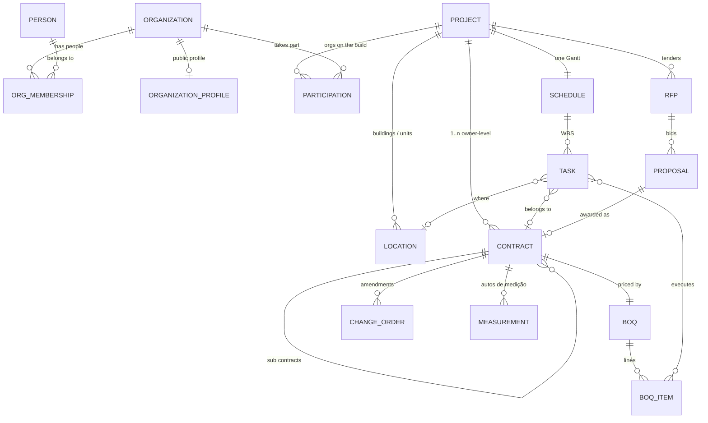

# 03 — Core model

The aggregates everything else hangs on. Physical tables and seed data: [15](./15-data-model.md). Money fields are integer cents in EUR. All ids are UUIDv7.

## Entity overview

## Organization & Person (Identity)

**Person**: `id`, `email` (unique), `name`, `phone`, `locale`, `auth_subject` (IdP id).

**Organization**
| Field | Notes |
|---|---|
| `kind` | `household` (private owner) · `general_contractor` · `specialty_contractor` · `consultant` (architect, engineer, inspector, HSE) · `supplier` (future) |
| `legal_name`, `nif` | NIF optional for `household` |
| `billing_subscription_id` | Billing reference |

**OrgMembership**: `(person, org, org_role)` with `org_role ∈ {admin, manager, member}`.
- `admin`: billing, members, profile. `manager`: create projects/RFPs/proposals, sign contracts.
  `member`: works on projects they are staffed on.

**ProjectStaffing**: `(person, org, project)` — which of an org's people work on a given project.
An org admin/manager staffs people; a person sees a project only if staffed (admins see all
projects of their org).

*Invariant:* a household has 1..2 people in practice (couple); its approval policy is an org
setting `approval_policy ∈ {any, all}` (open question — see [14](./14-open-questions.md)).

## Project

| Field | Notes |
|---|---|
| `owner_org_id` | Always a `household` or a company acting as owner (developer) |
| `name`, `address`, `municipality` | Municipality drives marketplace matching |
| `typology`, `gross_area_m2`, `indicative_budget_cents` | The brief (pre-project) |
| `status` | `draft` → `tendering` → `contracted` → `in_execution` → `closed` (· `cancelled`) — see [09](./09-state-machines.md) |
| `created_by_org_id` | Owner, or a supplier creating it on the owner's behalf (owner must claim it) |

**Location**: `(project, name, kind ∈ {site, building, unit, floor, zone}, parent_id)`. Lets one
project hold an allotment or terraced houses; tasks and documents can be scoped to a location.

**Participation**: `(project, org, capacity, source)` — the derived list of organizations on the
build. `capacity ∈ {owner, prime_contractor, direct_contractor, subcontractor, consultant}`.
`source ∈ {contract, invitation}`: most participations are created automatically when a contract
is signed; consultants without a priced contract join by invitation.

## Contract (Contracting)

| Field | Notes |
|---|---|
| `project_id` | |
| `kind` | `prime` · `direct` · `sub` · `service` (consultant fee) |
| `parent_contract_id` | Required iff `kind = sub` |
| `client_org_id`, `supplier_org_id` | The two parties. For `prime`/`direct` the client is the project owner. For `sub`, the client is the parent contract's supplier. |
| `specialties[]` | What the contract covers |
| `scope_inclusions`, `scope_exclusions` | Explicit text, affirmative |
| `boq_id` | The priced Bill of Quantities |
| `payment_terms` | `measurement_monthly` · `milestones` · `mixed`; `retention_pct` (default 5); payment days |
| `start_date`, `end_date` (contractual) | Mirrors contractual milestones in the baseline |
| `revision` | Incremented by each approved change order |
| `origin` | `award` (from proposal id) · `direct_entry` |
| `status` | `draft` → `signed` → `active` → `provisionally_received` → `closed` (· `terminated`) |
| `sponsored_by_org_id` | Optional — the client covers the supplier's entitlement for this project (D-05) |

**BoQ / BoqItem**: `chapter`, `code`, `description`, `unit`, `quantity`, `unit_price_cents`,
`specialty`, `location_id?`. Contract value = Σ quantity × unit price (+ approved change orders).

**Invariants**
- C1 `client ≠ supplier`.
- C2 A `sub` contract's client equals its parent's supplier; its project equals the parent's.
- C3 A project has at most one `prime` contract in status ≥ `signed`. `prime` and `direct`
  contracts may coexist only if the prime's scope excludes the direct contracts' specialties
  (warning, not a block — the scope-gap checklist flags overlaps).
- C4 After `signed`, BoQ, dates and terms change only through an approved **ChangeOrder**.
- C5 Money never lives outside Contracting.

## Why this replaces the as-is roles
The as-is authorizes by a fixed membership role (`owner/counterparty/subcontractor`, one each per
project). In the to-be, **what you may see and do on an object is derived from your organization's
relationship to it** — owner of the project, client or supplier of the contract, assignee of the
task, participant of the project. Adding a second subcontractor, a second direct contractor or a
consultant needs no model change.
