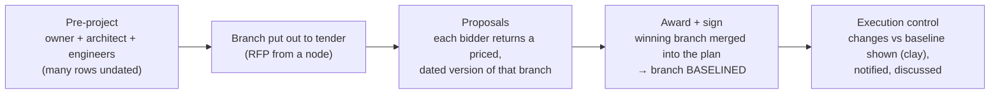

# 05 — Planning & execution (the plan / WBS)

The central tool, specified as **behaviour** so the API can be defined before the UI. Tables live in
[15](./15-data-model.md); endpoints in [12](./12-api-catalogue.md). Decisions D-21 to D-30 in
[01](./01-decisions.md) come from the 2026-09-24 session.

## 1. What the plan is

- **One plan per project, and it is a WBS.** Every row is a node of one tree. The timeline is a view
  of that tree, not a separate object.
- **There is no draft.** The plan is composed over time by the parties who join the build. Nobody
  starts with a complete plan: the owner first gathers the architect and the specialty engineers,
  goes to the municipality for licences, then tenders. The plan grows as each party contributes its
  branch (D-24).
- **Baseline is a label on a branch, not a version of the plan.** When a contract is signed, the
  branch it covers is baselined: scope, time, cost and quality are frozen as the reference (PMP).
  From then on that branch is **controlled**; everything else keeps being **planned**.



## 2. Rows

| Kind | Rule |
|---|---|
| `task` | A leaf. Has its own dates (optional), duration, assignee, cost lines, documents. |
| `summary` | Any node with children. **Dates are derived** (envelope of the children). **Cost is derived** (own lines + Σ children). A task becomes a summary as soon as it gets a child. |
| `milestone` | Zero duration, date optional. Contractual milestones (licence issued, provisional reception) are milestones. |

- **Depth is the user's choice, from 1 to 10 levels** (D-25). The API rejects level 11 with `too_deep`.
  "Phase" is not a separate type: it is a top-level summary.
- Ordering among siblings uses a fractional position key, so two people reordering different rows
  never conflict.

### Dates are optional — and that is fine

- Many rows cannot honestly be dated: *submit the licence application* has a date; *licence issued*
  depends on the municipality. A row may be:
  - `dated` — planned start and finish;
  - `undated` — no dates yet;
  - `external` — waits on a third party: start may be dated, finish is open until the **actual** date is
    recorded. Drawn as an open-ended bar.
- Undated rows are allowed in every phase, including execution. They are never blocked. They are
  **flagged** by the plan-health check at the moments where it matters (§9).

## 3. Links

**No link, no chaining.** Rows move together only when someone has linked them explicitly. An
unlinked row keeps its own dates whatever happens around it.

Three link types, optional on any row (tasks, summaries, milestones), across any branch and any
organisation (D-21):

A link joins an **anchor** of one row (its start or its end) to an anchor of another (D-32):

| From (predecessor) | To (successor) | Label in the UI | Rule for the successor | Classic name |
|---|---|---|---|---|
| end | start | Starts when it ends | `start = next working day after predecessor.finish + lag` | FS |
| start | start | Starts with | `start = predecessor.start + lag` | SS |
| end | end | Ends with | `finish = predecessor.finish + lag` | FF |
| start | end | *(not offered in the UI)* | `finish = predecessor.start + lag` | SF — valid in the API, hidden |

The API stores `from_anchor` and `to_anchor`, not a type name, so the gesture ("drag from the end
of this bar to the start of that one") and the stored link are the same thing.

- A link is **rigid**: it holds the successor at that position, in both directions (D-22).
- `lag` is in working days, default 0, may be negative (overlap).
- A row with several incoming links sits at the **latest** position they require. That is the only
  position that satisfies all of them.
- Cycles are rejected (`409 dependency_cycle`, with the cycle path).
- A link to a summary uses the summary's derived envelope.
- A link from or to an `undated`/`external` row does nothing until that row has the relevant date.

## 4. How dates move (D-21, D-22)

Dates move in two ways only: someone with edit rights edits a row, or a link moves it.

**Propagation.** After every accepted change, the server walks the successors of the changed row
in topological order and re-applies each link:
- the predecessor moves later ⇒ the linked successor is **pushed** later;
- the predecessor moves earlier ⇒ the linked successor is **pulled** earlier;
- the successor's **duration is kept**. With *ends with*: extend the predecessor's end by 5 days ⇒
  the successor ends 5 days later and therefore also starts 5 days later;
- it crosses organisations and contracts. Each moved row records
  `cause = propagated from <task>, triggered by <person/org>`, and its assignee is notified.

**Editing a linked row.**
- Dragging a linked successor **changes its lag**: the link is kept and the new offset is stored.
  The UI shows it ("starts after Alvenarias +3 wd").
- Resizing changes its duration. For an end→end successor the finish is held by the link, so resizing
  moves its start.
- To free a row, remove the link.
- Dragging a **summary** shifts its whole subtree by the same number of working days. It needs edit
  rights on every row that moves; otherwise the server answers `forbidden` with the list of blocked
  rows. A summary cannot be resized directly.

**Rows that have already happened.**
- A row that has **started** keeps its actual start: neither a push nor a pull moves it, and only
  its finish can move. A row that is **done** never moves.
- If a link can no longer hold because the successor already started, the row gets a
  `sequence_warning` ("started before its predecessor allowed" or "held at its actual start").

**Calendar.** All arithmetic is in **working days** on the project calendar: work week, PT national
and municipal holidays, project closures. Non-working days are shaded on the canvas.

## 5. Baseline and execution control (D-23)

- On contract signature, the covered branch gets a **baseline snapshot** per row: dates, duration,
  scope text, acceptance criteria (quality) and cost lines (cost). Baselines are versioned; a new one
  is taken only when a change is formally accepted into the baseline (§6).
- For every controlled row the API returns render-ready **segments**, so no client computes them:

| Segment | Meaning | Drawn as |
|---|---|---|
| `baseline` | the baselined span | ghost bar |
| `current` | the current planned span | normal bar |
| `extension` | part of `current` beyond `baseline.finish` | **clay** (`status-pending-change`, #a9601f / dark #c9812f), always with a label, never colour alone |
| `delay_start` | gap between `baseline.start` and `current.start` | clay hatch on the ghost |
| `actual` | from the actual start to today / the actual finish | progress fill |

- Rows **added** after the baseline inside a controlled branch carry `added_after_baseline`. Rows
  **removed** stay visible to the owner as removed (soft delete) in the change view.

## 6. Changes after baseline: show the change, do not gate it (D-23)

What matters is **making the change visible**, not collecting an approval.

- Every change to a controlled row automatically records a **Variation**:

| Kind | Triggered by |
|---|---|
| `time` | start/finish/duration differ from the baseline (direct edit or propagation) |
| `cost` | a cost line's quantity or unit price differs from the baseline, or a line is added/removed |
| `material` | a cost line's material specification changes |
| `scope` | row added/removed after baseline, or scope text / acceptance criteria changed |

- The variation holds baseline value, previous value, new value, delta, who, when and cause (direct
  or propagated from which task). It is continuously updated: it shows the **net** position against
  the baseline plus the full history.
- **Notification.** The owner (and the contract client of the row, if different) is notified, with a
  deep link to the **change view**: "Attention: time / cost / material changed". Changes are grouped
  per project in a 15-minute window, with the net effect on the project end date and on cost, so a
  GC editing four rows produces one notification, not four.
- **What the owner can do** — none of it is required for work to continue:
  - **acknowledge** — records that they saw it (who, when): in a dispute, "you were notified at T and
    opened it at T2" is itself part of the record;
  - **question** — opens a question on the row, addressed to the responsible party (see [08](./08-supporting-domains.md));
  - contact them outside the platform (phone). The platform does not force a channel;
  - optionally **formalise**: turn it into a change order ([06](./06-tendering-and-contracting.md)) which, once
    approved, takes a new baseline for those rows. Formalising is a choice, not the gate.
- The responsible party **adjusts** the plan if they agree after the discussion. That adjustment is
  just another edit, and another entry in the variation's history.
- Visibility: time and scope variations are visible to every participant. Cost and material variations
  follow the cost-line visibility (V2/V5): the owner never sees the GC's internal subcontract numbers.

## 7. Many people, one plan, at the same time (D-26)

- **Save on commit.** A change is sent when the user commits it: drops a bar, leaves a cell or
  closes the field editor. Not per keystroke, not per whole tree.
- **Deltas, not documents.** `PATCH /tasks/{id}` carries only the changed fields, plus each field's
  `base` value (what the client saw before editing).
- **Field-level last-write-wins.** The server applies deltas in arrival order. Two people changing
  different fields of the same row both win. On the same field, the last one wins. The response and
  the SSE event carry `overwrote: {field, by, at}` when a `base` did not match, and the overwritten
  author is notified. Every applied delta is in the ledger (who, when, before, after).
- **Propagation runs after each delta**, and every changed row is broadcast on the project's SSE
  stream with the author and the cause. Clients merge the pushed rows. There is no "reload to see changes".
- Multi-row structural operations (move or indent a subtree, insert a template, paste rows) go through
  one atomic batch call.
- Editing a row that was deleted meanwhile returns `410 gone`.

## 8. Cost column (D-27)

- A row has **cost lines**: description, unit, quantity, unit price, material specification, and the
  contract whose price they are. These are the BoQ, attached to where the work is.
- The cost column shows a value **only when the row or its subtree has cost lines the viewer may
  see**; otherwise it is empty (not zero).
- A summary **aggregates** its own lines and all its descendants' lines, per viewer: the owner's roll-up
  uses the prices of the owner's contracts; the GC's view can show revenue, cost and margin; a
  subcontractor sees its own price (V5, [04](./04-visibility-and-access.md)).

## 9. Plan health (D-28)

A computed check, never blocking, returned by `GET /projects/{id}/schedule/health` and embedded in the
responses of the moments it matters:

| Check | Raised when |
|---|---|
| `undated_rows` | rows without dates in the branch |
| `unassigned_rows` | rows without an assignee |
| `open_external` | external rows still without an actual finish that have dated successors |
| `sequence_warnings` | rows started before their predecessor allowed |
| `uncosted_rows` | leaves without cost lines in a branch that is about to be tendered or signed |

Evaluation moments: before publishing an RFP for a branch, before a contract is signed (baseline),
and permanently in the execution health panel. The message tells the user what is missing, and that
proceeding is allowed.

## 10. Documents and requests for proposals from a row (D-29)

- Any row can hold documents (drawings, specs, photos).
- From any row (or several), the user can **request proposals**. The RFP package is that subtree:
  structure, scope text, documents and cost lines **with quantities and without prices**.
- **Recipients:** organisations found on the platform (filtered by specialty and the project's area)
  and/or plain email addresses.
- **Each recipient gets their own email** with a personal link. There is one message per recipient,
  so nobody ever sees who else was invited (better than BCC: it also lets the platform track per
  recipient: sent → opened → proposal submitted / declined).
- Each invitation opens a **proposal lane** drawn under the tendered row (dashed, collapsible, with the
  pre-computed comparison). Lanes are **not** rows of the plan: they never count in roll-ups, health
  or propagation, and each bidder sees only its own. A bidder answers either by building its plan in
  its lane, or by email (the issuer records the PDFs and the summary). On signature the winner's plan
  is copied into the tendered row and baselined (§5). See
  [06](./06-tendering-and-contracting.md) (D-36).
- Which rows are tendered also decides the contract shape: turnkey, direct or hybrid is derived from
  the tree, never declared (D-35).
- Tendering rules (clarifications, comparison, award) are in [06](./06-tendering-and-contracting.md).

## 11. Templates (D-30)

A template is the **know-how of the sequence**: once a GC knows how to plan, the structure and the
chaining rarely change. Only the set of specialties varies.

- **What it holds:** structure (rows, hierarchy, milestones, specialty of each row) and links.
  **No dates, no durations, no assignees, no prices.**
- **What can be saved:** the whole plan or any selected subtree.
- **Who can use it:** the author; the author's organisation; anyone, when shared publicly on the
  marketplace (a GC showing how they work); and a **LinkNMS library** of starter templates per
  construction type (detached house, terraced houses, renovation, allotment…), so the first users can
  import one and start.
- Templates are tagged by **construction type** and **phase** (pre-project, licensing, tendering,
  execution, handover).
- **Inserting** a template under any row lets the user **untick the specialties they do not need**.
  Links that passed through a removed row are **bridged** (A → B → C without B becomes A → C, keeping
  the anchors of A's outgoing and C's incoming side), so the chaining survives.
- Inserted rows are `undated` until someone dates them. Links start working as soon as rows get dates,
  and the plan-health check lists what is still undated.
- A template is a copy, not a live link: editing a template never changes plans that used it.

## 12. Who can change the plan (D-31, D-33)

**Branches.** When a contract is signed, the rows it covers get `contract_id`: that row and everything
under it is the supplier's **branch**. A subcontractor's branch sits inside the GC's branch, which sits
inside the owner's plan.

```
Owner — whole plan (licensing, coordination rows, every branch)
└── GC — prime branch (T-100, T-200, …)
    ├── Canalizações Norte — sub branch T-400
    └── Caixilharia Atlântico — sub branch T-500
└── Eletro Mota — direct branch T-450
```

| Who | Can change / create | Read-only |
|---|---|---|
| Owner | everything | — |
| GC | its branch, including its subcontractors' branches | owner rows, direct contractors' branches |
| Subcontractor | its own branch only | everything else |
| Direct contractor | its own branch only | everything else |
| Consultant (architect, inspector) | rows it is assigned to by the owner | everything else |

- **Creating rows.** Only inside your scope. A new row **inherits the assignee** of its nearest
  assigned ancestor: a row the GC adds under T-400 is assigned to Canalizações Norte automatically.
  The GC may change it (to itself or to another of its suppliers); the subcontractor may not reassign
  it to another organisation, only choose which of its own people.
- **Links.** You may create a link if the **successor** is in your scope, because the link will move
  it. The predecessor can be any row. A subcontractor can make its row start when the GC's masonry
  ends; it cannot make the GC's row wait for its own.
- **Propagation ignores scope.** A link, once created, moves its successor whoever triggered the change.
  The link was created by someone with that successor in scope, so the move is legitimate.
- **Confirmation.** Inside your scope, changing a row assigned to another organisation (the GC editing
  a subcontractor's row) asks "You are not responsible for this row. Change it anyway?", records the
  change and notifies the assignee.
- **Outside your scope** the plan is read-only: you can comment and ask questions on any row you can see.
- **Before a branch exists** (pre-project, rows not yet contracted), the rows are the owner's.
- Two limits hold everywhere: **cost lines** are edited only by the parties of their contract, and
  **`verified`** must come from the client chain above the row or an invited inspector, never from the
  organisation that marked the row `done` ([17 §5](./17-personas-roles-interactions.md)).

## 13. Progress and verification

Progress reports are append-only (`not_started`, `in_progress`, `blocked`, `done`, `verified`); see
[08](./08-supporting-domains.md). Status is derived from the latest report, never stored as an
editable column.
