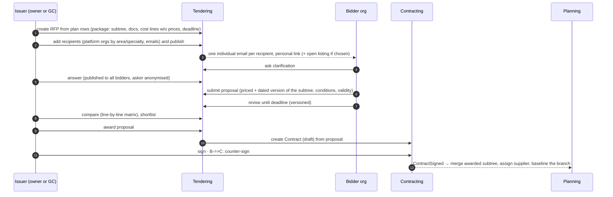
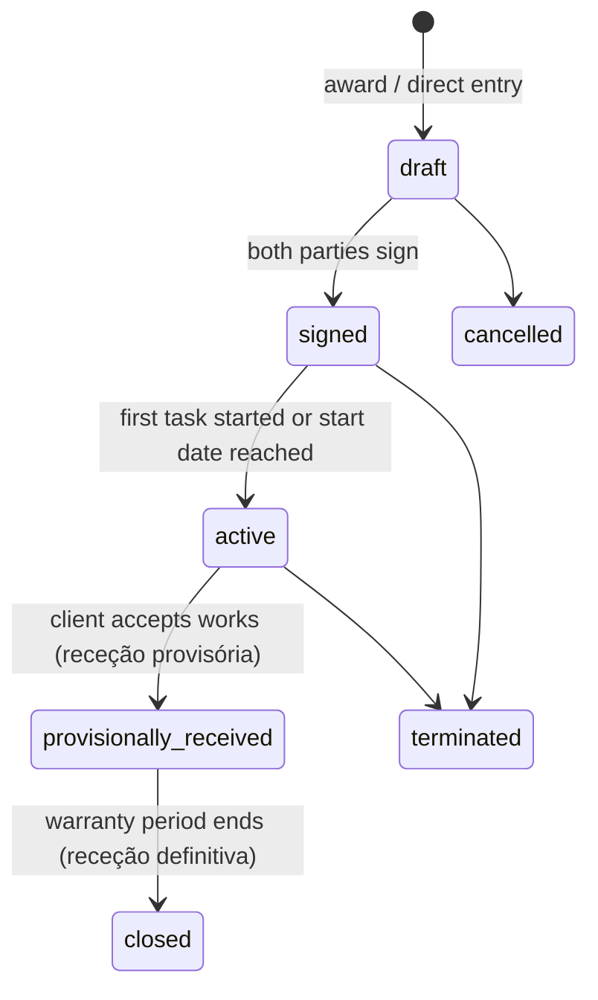

# 06 — Tendering & contracting

One tendering mechanism for every level: owner → GC / specialties, and GC → subcontractors.

## Flow



## RFP

| Field | Notes |
|---|---|
| `project_id`, `issuer_org_id` | |
| `level` | `owner` (issuer is project owner) · `sub` (issuer is supplier of `parent_contract_id`) |
| `specialties[]`, `location_ids[]` | |
| `root_task_ids` | the plan rows being tendered; the package is their **subtrees** ([05 §10](./05-planning-and-execution.md)) |
| `package` | snapshot of the subtrees: structure, scope text, documents, cost lines with quantities and **no prices** |
| `recipients[]` | platform organisations and/or email addresses; **each receives an individual email** with a personal link — never a shared or CC'd message |
| `visibility` | `invite_only` · `open` (listed to orgs matching specialty + municipality — D-15) |
| `submission_deadline`, `questions_deadline` | |
| `status` | `draft` → `published` → `closed` → `awarded` (· `cancelled`) |

Rules
- R1 A `sub`-level RFP can only package BoQ items and tasks belonging to the issuer's contract.
- R2 After `published`, the package may change only by an **addendum** (versioned, all bidders notified; deadline may be extended).
- R3 Proposals are sealed from other bidders (V8). The issuer sees proposals as they arrive (no sealed-bid opening in v1 — see [14](./14-open-questions.md)).

## The contract shape comes from the tree (D-35)

The owner never declares "turnkey", "direct" or "hybrid". The shape follows from **which rows the
owner tenders and awards**; the label is derived and shown, never asked (as `../03-operating-models.md`
already required).

```
TURNKEY — one RFP on the execution summary        DIRECT — one RFP per specialty row
Casa Silva                                         Casa Silva
├── Licenciamento            (owner)               ├── Licenciamento            (owner)
└── Execução  ◄ RFP → prime (GC)                   └── Execução                 (owner coordinates)
    ├── Estrutura                                      ├── Estrutura  ◄ RFP → direct (builder)
    ├── Canalização   ◄ GC's own sub-RFP               ├── Canalização ◄ RFP → direct (plumber)
    └── Eletricidade  ◄ GC's own sub-RFP               └── Eletricidade ◄ RFP → direct (electrician)

HYBRID — prime on part of the tree, direct on the rest
Casa Silva
├── Licenciamento                 (owner)
└── Execução
    ├── Estrutura + Alvenarias + Cobertura  ◄ RFP → prime (GC) → GC sub-RFPs inside
    └── Eletricidade                        ◄ RFP → direct (electrician)
```

- A row awarded to a GC becomes a **prime** branch; the GC tenders inside it with the same mechanism
  (sub-RFPs → **sub** branches).
- A row awarded by the owner to a specialty becomes a **direct** branch.
- `project.operating_model` is **derived**: only prime ⇒ turnkey, only direct ⇒ direct, both ⇒ hybrid.

## Proposals live in a lane on the tendered row, not in the plan (D-36)

**The founder's idea:** from the RFP, create one child task per invitee, assigned to them. Each holds
that invitee's plan, and the parent shows the comparison. **The UX is kept.** The storage is not: bids
must not be real rows of the WBS.
- **Roll-ups would lie.** The parent's cost and dates aggregate their children, so three competing
  bids would add up to three times the price and the widest envelope.
- **Visibility would leak.** Every participant reads the whole plan (V1), so the GC already on site
  would see the price of the electricians competing for a direct contract.
- **The ledger would fill with noise.** Losing rows get created, edited and deleted on the project's
  record.

So each invitation opens a **proposal lane**:

```
Canalização  [RFP · 3 invited · closes 06-05]            ← the tendered row (real WBS row)
  ┆ Canalizações Norte   €7,600   9 wd   plan ✓  docs 2   → open proposal     ← lane (Tendering,
  ┆ Hidro Maia           €8,900  12 wd   plan ✗  PDF (email)  → open proposal    not Planning)
  ┆ AquaPorto            —  opened, no answer yet
```

- **Drawn under the tendered row** as dashed, collapsible pseudo-rows with the comparison
  pre-computed: total, duration, start/finish, missing lines, variants, documents, status. Each lane
  links to the full proposal.
- **Stored in Tendering** (`proposal`, `proposal_row`, `proposal_line`), with scope `rfp_private`.
  It never enters the plan's roll-ups, health checks or propagation.
- **Who sees a lane:** the issuer sees all of them; each bidder sees **only its own**; nobody else,
  including the GC already on the build, sees any.
- **Two ways to answer** each invitation:
  1. **On LinkNMS.** The bidder opens its lane, which is a private copy of the packaged subtree, and
     builds **its plan**: child rows, durations or dates, links, prices per line, documents.
  2. **By email.** The bidder replies with PDFs. The issuer records the answer in the lane
     ("received by email"): uploads the documents and types total price, duration and conditions.
     The lane is marked `channel = email` and has no plan.
- **Comparison matrix** (issuer only): lines × proposals with unit price, line total, deviation from
  the median and missing lines, plus duration per packaged row.

## Proposal

`rfp_id`, `recipient_id` (lane), `bidder_org_id` (null until an emailed bidder signs up), `channel`
(`platform` · `email`), `version`, `proposed_subtree` (only for `platform`), `priced_lines`, `summary`
(total, duration, earliest start — typed by the issuer for `email`), `document_ids`, `conditions`,
`validity_until`, `status`: `invited` → `draft` → `submitted` → (`withdrawn`) → `shortlisted` →
`awarded` | `declined`.

## Award: from lane to plan

- **Award** creates a `Contract` in `draft` with the proposal's lines and conditions.
- **On signature:**
  - `channel = platform`: the bidder's plan is **copied** into the project under the tendered row
    (structure, dates, links, cost lines) and assigned to the supplier. The branch is baselined.
  - `channel = email`: the tendered row keeps its packaged children, is assigned to the supplier and
    becomes its branch. The supplier builds the detail there later, and the baseline is taken from
    what exists at signature (plan health flags what is missing).
- The losing lanes become `declined`. They stay visible to the issuer and to their own author only,
  as evidence of the tender.

## Contract lifecycle



- Signing is an in-app acceptance by a `manager` of each org, recorded in the ledger (not a
  qualified e-signature; an uploaded signed PDF can be attached as evidence).
- On `signed`: Participation created, tasks bound, baseline taken, reputation eligibility clock
  starts at `provisionally_received` or `terminated`.

## Change orders (D-08, optional since D-23)

After baseline the plan changes freely and every change is recorded as a **variation**
([05 §6](./05-planning-and-execution.md)). A change order is the optional step that formalises one or
more variations into the contract and re-baselines them.

| Field | Notes |
|---|---|
| `contract_id`, `number` | sequential per contract |
| `kind` | `scope` · `time` · `scope_and_time` |
| `boq_delta[]` | added/removed/changed lines (qty and/or unit price) |
| `time_delta` | new contractual dates for affected milestones/tasks |
| `reason`, `document_ids[]` | |
| `linked_change_order_id` | the back-to-back pair (sub CO ↔ prime CO) |
| `proposed_by_org_id`, `decided_by_org_id` | two-sided: must differ |
| `status` | `draft` → `submitted` → `approved` / `rejected` (· `withdrawn`) |

- Approval increments `contract.revision`, applies the BoQ delta, and — for `time` — creates a new
  baseline version for the affected tasks.
- Back-to-back: a GC may create a prime CO **linked** to a sub CO. The owner sees the prime CO
  (V2) and — by V3 — that a linked sub change exists, without its price.
- Idempotent replay via `Idempotency-Key` (as-is behaviour kept).

## Measurements & payments (D-10)

**Measurement** (auto de medição): `contract_id`, `period`, lines `(boq_item_id, quantity_this_period)`,
`status`: `draft` → `submitted` → `approved` / `disputed`.
- Suggested quantities come from tasks `verified` in the period that link BoQ items.
- Approved measurement produces an **expected invoice**: gross − retention.

**PaymentRecord**: `(contract, measurement?, amount, declared_paid_at by client, confirmed_at by supplier)`.
Status `expected` → `declared_paid` → `confirmed` (· `disputed`). No money moves through LinkNMS.

**Owner cash-flow view** = Σ expected invoices and milestones across all owner-level contracts, by
due date. Sub-level payments are never in the owner's view (V3).
