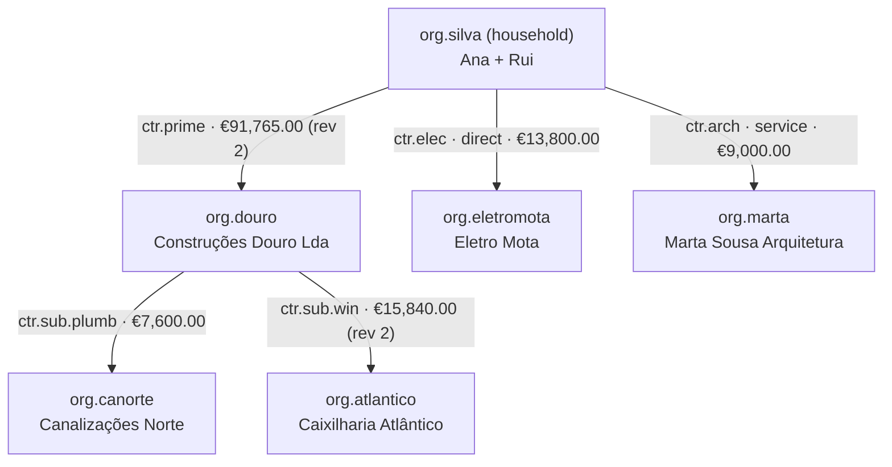

# 15 — Data model (with seed data)

The physical data model of the to-be, schema by schema, followed by **one complete mocked build**
recorded end to end, so every table can be seen holding real-looking rows and every visibility
rule can be seen applied.

- **Executable version:** [`db/v2/`](../../../db/v2/README.md) (DDL + this seed + checks). Keep them in sync.
- Aggregates and invariants: [03](./03-core-model.md). Visibility rules: [04](./04-visibility-and-access.md).
  This document owns **tables, columns, types, constraints and the seed scenario**.
- Postgres; one schema per module; **no cross-schema foreign keys** — cross-module references are
  bare `uuid` columns validated through ports (as-is rule, kept).
- Every table has `id uuid` (UUIDv7) primary key unless noted, plus `created_at timestamptz`.
  Mutable aggregates add `updated_at` and `version int` (optimistic concurrency). These columns are
  omitted below for brevity.
- Money: `bigint` cents, EUR only in v1. Quantities: `numeric(14,3)`. Schedule dates: `date`.
- Enums are `text` + `CHECK` (closed types). Transitions are decided in code ([09](./09-state-machines.md)).
- Columns marked **derived** are not stored as source of truth — they are computed or projected.
  Where they are materialised for read speed, the source is named.

---

## Part 1 — Tables

### `identity`

**person**
| Column | Type | Constraints / notes |
|---|---|---|
| email | text | UNIQUE, lower-cased |
| name | text | |
| phone | text | nullable |
| locale | text | `pt-PT` · `en` · `es` |
| auth_subject | text | UNIQUE — IdP (Clerk) subject |

**organization**
| Column | Type | Constraints / notes |
|---|---|---|
| kind | text | CHECK in (`household`, `general_contractor`, `specialty_contractor`, `consultant`, `supplier`) |
| legal_name | text | |
| nif | text | nullable; UNIQUE when not null |
| approval_policy | text | CHECK in (`any`, `all`); households only, default `any` |
| subscription_id | uuid | → billing.subscription (no FK) |

**org_membership** — `UNIQUE(org_id, person_id)`
| Column | Type | Notes |
|---|---|---|
| org_id, person_id | uuid | |
| org_role | text | CHECK in (`admin`, `manager`, `member`) |
| status | text | `invited` · `active` · `removed` |

**org_invitation**: `org_id, email, org_role, token_hash (sha256), status (pending/accepted/revoked), expires_at`.

**project_staffing** — `PK(project_id, org_id, person_id)`: which people of an org work on a project.

### `project`

**project**
| Column | Type | Constraints / notes |
|---|---|---|
| owner_org_id | uuid | nullable only while `status = draft` and created on behalf |
| created_by_org_id | uuid | |
| name, address | text | |
| municipality_code | text | INE/DICOFRE code — drives marketplace matching and holiday calendar |
| typology | text | e.g. `T3` |
| gross_area_m2 | numeric(10,2) | |
| indicative_budget_cents | bigint | the brief; never contractual |
| status | text | CHECK in (`draft`, `tendering`, `contracted`, `in_execution`, `closed`, `cancelled`) |

**location** — `(project_id, parent_id, kind CHECK in (site, building, unit, floor, zone), name, position)`.

**participation** — `UNIQUE(project_id, org_id, capacity)`
| Column | Type | Notes |
|---|---|---|
| project_id, org_id | uuid | |
| capacity | text | `owner` · `prime_contractor` · `direct_contractor` · `subcontractor` · `consultant` |
| source | text | `contract` (with `contract_id`) · `invitation` |
| contract_id | uuid | nullable |
| status | text | `active` · `ended` |

**project_calendar** — `PK(project_id)`: `work_days smallint[]` (ISO weekday), `closures daterange[]`;
holidays are resolved from a shared `platform.holiday(date, scope: national|municipality_code)` table.

### `tendering`

**rfp**
| Column | Type | Notes |
|---|---|---|
| project_id, issuer_org_id | uuid | |
| level | text | `owner` · `sub` |
| parent_contract_id | uuid | required iff `level = sub` |
| title, scope_text | text | |
| specialties | text[] | specialty codes |
| visibility | text | `invite_only` · `open` |
| questions_deadline, submission_deadline | timestamptz | |
| package_version | int | incremented by each addendum |
| status | text | `draft` · `published` · `closed` · `awarded` · `cancelled` |
| awarded_proposal_id | uuid | nullable |

**rfp_root** — `PK(rfp_id, task_id)`: the plan rows being tendered; the package is their subtrees.
**rfp_package_row**: snapshot of each packaged row at publish/addendum — `rfp_id, package_version, task_id, parent_task_id, name, scope_text, duration_wd?, position`.
**rfp_item** (packaged cost lines, **no prices**): `rfp_id, package_version, task_id, code, description, unit, quantity, material_spec, specialty`.
**rfp_recipient**: `rfp_id, org_id?, email, token_hash, email_message_id, status (queued/sent/opened/declined/proposal_submitted/bounced), sent_at, opened_at` — **one individual email per row** (D-29).
**rfp_addendum**: `rfp_id, package_version, summary, published_at`.
**project.operating_model** is derived (D-35): prime only ⇒ turnkey · direct only ⇒ direct · both ⇒ hybrid.
**clarification**: `rfp_id, asked_by_org_id (never exposed to other bidders), question, answer, answered_at, status (open/answered)`.

**proposal** — one per recipient (the **lane**, D-36), `UNIQUE(rfp_id, recipient_id)`
| Column | Type | Notes |
|---|---|---|
| rfp_id, recipient_id | uuid | |
| bidder_org_id | uuid | null until an emailed recipient signs up |
| channel | text | `platform` (bidder builds its plan) · `email` (issuer records PDFs + summary) |
| summary_total_cents, summary_duration_wd, summary_start | | typed by the issuer for `email`; derived from the plan for `platform` |
| recorded_by_person_id | uuid | issuer who recorded an emailed answer |
| current_revision | int | |
| status | text | `invited` · `draft` · `submitted` · `withdrawn` · `shortlisted` · `awarded` · `declined` |
| validity_until | date | |
| conditions | text | |

**proposal_revision** — append-only, `UNIQUE(proposal_id, revision)`: `total_cents (derived, materialised)`, `submitted_at`.
**proposal_line**: `proposal_revision_id, rfp_item_id (nullable for variants), is_variant bool, description, unit, quantity, unit_price_cents`.
**proposal_row**: `proposal_revision_id, row_id (client uuid), packaged_task_id? (null = row added by the bidder), parent_row_id, name, duration_wd, start?, finish?, position` + **proposal_link** `(proposal_revision_id, predecessor_row_id, successor_row_id, type, lag_wd)` — the bidder's version of the subtree.

### `contracting`

**contract**
| Column | Type | Constraints / notes |
|---|---|---|
| project_id | uuid | |
| kind | text | CHECK in (`prime`, `direct`, `sub`, `service`) |
| parent_contract_id | uuid | FK self; CHECK `(kind = 'sub') = (parent_contract_id IS NOT NULL)` |
| client_org_id, supplier_org_id | uuid | CHECK `client_org_id <> supplier_org_id` |
| reference | text | human number, e.g. `C-2026-014` |
| specialties | text[] | |
| scope_inclusions, scope_exclusions | text | |
| payment_terms | text | `measurement_monthly` · `milestones` · `mixed` |
| retention_bp | int | basis points (500 = 5 %) |
| payment_days | int | |
| contractual_start, contractual_end | date | |
| revision | int | +1 per approved change order |
| origin | text | `award` · `direct_entry`; `origin_proposal_id` when award |
| status | text | CHECK in (`draft`, `signed`, `active`, `provisionally_received`, `closed`, `cancelled`, `terminated`) |
| sponsored_by_org_id | uuid | nullable (D-05 sponsorship) |
| value_cents | bigint | **derived** — Σ active boq_item lines; materialised on each approved CO |

Partial unique index: one `prime` per project where `status NOT IN ('draft','cancelled','terminated')`.

**contract_signature** — `UNIQUE(contract_id, org_id)`: `person_id, signed_at, evidence_document_id?`.

**boq_item**
| Column | Type | Notes |
|---|---|---|
| contract_id | uuid | FK; **null** = owner's pre-contract estimate (visible to the owner only) |
| task_id | uuid | the plan row where the work is (D-27) — this is the task's **cost line** |
| chapter, code | text | `UNIQUE(contract_id, code)` |
| description, unit | text | |
| quantity | numeric(14,3) | |
| unit_price_cents | bigint | **commercial** (V2 only) |
| material_spec | text | brand / model / finish — a change raises a `material` variation |
| specialty, location_id | text, uuid | |
| introduced_by_change_order_id | uuid | null for original lines |
| superseded_by_change_order_id | uuid | set when a CO replaces the line (lines are never updated in place after signature) |
| parent_boq_item_id | uuid | the prime line a sub line fulfils (back-to-back traceability) |

**change_order** — `UNIQUE(contract_id, number)`
| Column | Type | Notes |
|---|---|---|
| contract_id | uuid | |
| number | text | e.g. `CO-P-001` |
| kind | text | `scope` · `time` · `scope_and_time` |
| reason | text | |
| amount_delta_cents | bigint | **derived** from lines; materialised |
| linked_change_order_id | uuid | back-to-back pair |
| proposed_by_org_id, decided_by_org_id | uuid | CHECK `decided_by_org_id <> proposed_by_org_id` |
| decided_by_person_id, decided_at, decision_note | | |
| idempotency_key | text | UNIQUE nullable |
| status | text | `draft` · `submitted` · `approved` · `rejected` · `withdrawn` |

**change_order_line**: `change_order_id, op (add/replace/remove), boq_item_id?, new: {code, description, unit, quantity, unit_price_cents}`.
**change_order_time**: `change_order_id, task_id, new_baseline_start, new_baseline_finish`.

**measurement** — `UNIQUE(contract_id, period)`: `period (e.g. 2026-07), status (draft/submitted/approved/disputed), gross_cents, retention_cents, net_cents (derived, materialised), approved_by_person_id, approved_at`.
**measurement_line**: `measurement_id, boq_item_id, quantity_this_period, cumulative_quantity (derived)`.

**payment_record**: `contract_id, measurement_id?, milestone_label?, amount_cents, due_date, status (expected/declared_paid/confirmed/disputed), declared_paid_at, declared_by_person_id, confirmed_at, confirmed_by_person_id`.

### `planning`

**task** (a row of the WBS — behaviour in [05](./05-planning-and-execution.md))
| Column | Type | Notes |
|---|---|---|
| project_id | uuid | |
| parent_id | uuid | FK self; `depth` ≤ 10 (D-25) |
| depth | smallint | materialised, 1–10 |
| position | text | fractional index among siblings (concurrent reorders never collide) |
| kind | text | `task` · `summary` · `milestone` — `summary` is **derived** (has children) |
| name, description | text | |
| specialty | text | catalogue code |
| location_id | uuid | |
| contract_id | uuid | set when the branch is awarded/signed; **not shown as a column** (D-27) |
| assignee_org_id, assignee_person_id | uuid | |
| assignee_inherited | bool | true = copied from the nearest assigned ancestor; changes when that ancestor is reassigned. An explicit assignment sets it to false (D-33) |
| branch_contract_id | uuid | **derived**: nearest ancestor-or-self `contract_id` — drives edit scope (D-33) |
| dating_mode | text | `dated` · `undated` · `external` (D-28) |
| start, finish | date | the plan's current dates; nullable; for summaries **derived** (envelope of children) |
| duration_wd | int | working days, project calendar |
| actual_start, actual_finish | date | **derived** from progress; `external` rows record `actual_finish` explicitly |
| baseline_start, baseline_finish | date | **derived** from the latest `baseline_task` (materialised) |
| schedule_state | text | **derived**: `planned` · `on_baseline` · `extended` · `sequence_warning` |
| acceptance_criteria | text | quality |
| last_changed_by_person_id, last_changed_at, last_change_cause | | cause: `direct` · `propagated:<task_id>` · `template` · `import` |
| deleted_at | timestamptz | soft delete — removed rows stay visible in the change view |

**task_field_change** — append-only, one row per applied field delta (D-26)
| Column | Type | Notes |
|---|---|---|
| task_id, field | uuid, text | |
| old_value, new_value, base_value | jsonb | `base_value` = what the client saw; ≠ `old_value` ⇒ an overwrite |
| changed_by_person_id, changed_by_org_id, changed_at | | |
| cause | text | `direct` · `propagated` (with `cause_task_id`) |
| client_change_id | uuid | idempotency |

**checklist_item**: `task_id, text, done bool, done_by_person_id, done_at, position`.

**link** — `UNIQUE(predecessor_id, successor_id)`
| Column | Type | Notes |
|---|---|---|
| predecessor_id, successor_id | uuid | CHECK `<>`; cycle check in code |
| from_anchor, to_anchor | text | `start` · `end` each; UI offers end→start, start→start, end→end (D-32) |
| lag_wd | int | default 0, may be negative |
| created_by_org_id, created_by_person_id | uuid | must have the successor in edit scope (D-33) |

**baseline** — `UNIQUE(root_task_id, version)`: `project_id, root_task_id (the baselined branch), contract_id, version, reason (contract_signed/change_order), change_order_id?, taken_at`.
**baseline_task** — `PK(baseline_id, task_id)`: `start, finish, duration_wd, name, scope_text, acceptance_criteria` (immutable snapshot: time, scope, quality).
**baseline_cost_line** — `PK(baseline_id, boq_item_id)`: `quantity, unit_price_cents, material_spec` (cost snapshot; commercial visibility applies).

**variation** — one per (task, kind) while open (D-23)
| Column | Type | Notes |
|---|---|---|
| project_id, task_id | uuid | |
| kind | text | `time` · `cost` · `material` · `scope` |
| scope_type, scope_id | | `project` for time/scope; `contract` for cost/material (V2) |
| baseline_value, current_value | jsonb | e.g. `{"finish": "2026-09-11"}` vs `{"finish": "2026-09-25"}` |
| delta | jsonb | e.g. `{"finish_wd": 10}`, `{"amount_cents": 246000}` |
| first_changed_at, last_changed_at, last_changed_by_org_id | | |
| cause | text | `direct` · `propagated` (+ `cause_task_id`) |
| status | text | `open` · `acknowledged` · `formalised` · `closed` |
| change_order_id | uuid | when formalised |

**variation_ack**: `variation_id, org_id, person_id, acknowledged_at` — re-opened variations need a new ack.
**variation_digest**: `project_id, window_start, window_end, variation_ids uuid[], net_project_finish_delta_wd, net_cost_delta_cents (per recipient), sent_to_person_ids` — the 15-minute grouped notification.

**progress_report** — append-only (no UPDATE/DELETE grant)
| Column | Type | Notes |
|---|---|---|
| task_id | uuid | |
| seq | int | `UNIQUE(task_id, seq)` |
| status | text | `not_started` · `in_progress` · `blocked` · `done` · `verified` |
| percent | smallint | 0–100, only when `in_progress` |
| note | text | required when walking back |
| photo_document_ids | uuid[] | |
| reported_by_org_id, reported_by_person_id | uuid | `verified` rows are written on behalf of the verifier |
| reported_at | timestamptz | |

`task.status` = status of the latest row (derived, never a column).

**plan_template** (D-30): `scope (personal/org/public/library), owner_person_id?, owner_org_id?, name, description, construction_type (detached_house/terraced/renovation/allotment/…), phase_tags text[], created_from_task_id?, uses_count`.
**plan_template_row**: `template_id, row_key, parent_row_key, position, kind (task/summary/milestone), name, specialty` — **no dates, durations, assignees or prices**.
**plan_template_link**: `template_id, from_row_key, to_row_key, from_anchor, to_anchor, lag_wd`.

### `quality`
**verification_request**: `task_id, requested_by_org_id, criteria_snapshot, status (pending/accepted/rejected), decided_by_org_id (CHECK ≠ requested_by_org_id), decided_by_person_id, reason, decided_at`.
**nonconformity**: `project_id, task_id?, contract_id?, raised_by_org_id, assigned_to_org_id, severity (minor/major/critical), description, status (open/assigned/fixed/closed/rejected_fix)`.
**inspection**: `project_id, inspector_org_id, date, checklist jsonb, findings text, task_ids uuid[]`.

### `documents`
**document**: `scope_type, scope_id, kind (drawing/bim/photo/spec/contract_doc/invoice/other), title, share_with_ancestors bool, current_version int`.
**document_version** — append-only, `UNIQUE(document_id, version_no)`: `storage_key, mime, size_bytes, sha256, uploaded_by_person_id, uploaded_by_org_id`.

### `collaboration`
**thread** — `UNIQUE(object_type, object_id)`: `project_id?`.
**comment**: `thread_id, author_person_id, author_org_id, kind (note/question/answer), body, mentions uuid[], addressee_org_id (questions), question_status (open/answered/resolved), answers_comment_id, edited_until, deleted_at`.
**meeting_minute**: `project_id, date, attendees uuid[] (orgs), status (draft/circulated/acknowledged)`; **minute_item**: `minute_id, text, owner_org_id, due_date, object_type?, object_id?`; **minute_ack**: `minute_id, org_id, person_id, at`.
**notification**: `person_id, event_id, category, title, object_ref, read_at`. **notification_preference**: `person_id, category, channel, enabled`.

### `directory`
**organization_profile** — `PK(org_id)`: `display_name, description, logo_document_id, specialties text[], tags text[], service_areas text[] (municipality/district codes), team_size_band, founded_year, declared_nif, declared_impic_number, declared_impic_class, declared_insurance, listed bool, completeness smallint (derived, materialised)`.
**portfolio_entry**: `org_id, source (platform/declared), contract_id?, title, municipality_code, typology, specialties, start_date, end_date, variance_wd?, photo_document_ids, owner_consent bool`.
**specialty** (catalogue): `code PK, name_pt, name_en, parent_code`.

### `reputation`
**review** — `UNIQUE(reviewer_org_id, subject_org_id, anchor_type, anchor_id)`: `anchor_type (contract/subcontract_work), anchor_id, rating_quality, rating_schedule, rating_communication, rating_payment?, body, status (submitted/published), published_at, reply_body, replied_at`.
**performance_snapshot** — `PK(org_id, computed_on)`: `on_time_rate, first_pass_rate, cos_per_contract, median_answer_hours, contracts_completed`.

### `billing`
**plan**: `code PK, org_kind, name, price_cents, interval (month/year/project), entitlements jsonb`.
**subscription**: `org_id UNIQUE, plan_code, status (trialing/active/past_due/canceled), current_period_end, provider_ref`.
**sponsorship**: `contract_id UNIQUE, sponsor_org_id, sponsored_org_id, starts_at, ends_at`.
**add_on**: `org_id, kind (open_rfp_credits/promotion), quantity, period`.

### `record`
**audit_event** — append-only; only writer is `record.append_event()` (SECURITY DEFINER)
| Column | Type | Notes |
|---|---|---|
| project_id | uuid | chain key; `UNIQUE(project_id, seq)`, `UNIQUE(project_id, entry_hash)` |
| seq | bigint | monotonic per project, advisory lock |
| occurred_at | timestamptz | |
| actor_person_id, actor_org_id | uuid | |
| category | text | module: `project` · `tendering` · `contracting` · `planning` · `quality` · `documents` · `collaboration` |
| type | text | event type, e.g. `contracting.change_order.approved` |
| scope_type, scope_id | text, uuid | `project` · `contract` · `org_private` (+ `rfp_private` for proposals) |
| object_type, object_id | text, uuid | what changed |
| payload | jsonb | before/after of the changed fields |
| payload_hash, prev_hash, entry_hash | bytea | `entry_hash = sha256(prev_hash ‖ payload_hash ‖ seq ‖ occurred_at ‖ scope)` |

### `platform`
**outbox**: `event_id PK, type, version, occurred_at, project_id, actor jsonb, scope jsonb, data jsonb, dispatched_at`.
**holiday**: `date, scope, name` — PT national + municipal holidays.
**idempotency_key** *(migration 0002)*: `key + caller (Clerk user id) + operation_id PK, request_hash, response_status, response_body, created_at, completed_at` — the doc-11 Idempotency-Key memory. The reservation is written in the same transaction as the command's domain write, so a rolled-back command leaves no reservation; a replay with the same body returns the stored response, a different body is `409 idempotency_mismatch`.

---

## Part 2 — Seed scenario: "Casa Silva"

A hybrid build, recorded as of **2026-09-24**. Ids are shown as readable aliases
(`org.silva`); in storage each is a UUIDv7 (e.g. `org.silva` = `01926f3a-7c10-7b21-9d3e-5a1b2c3d4e01`).

**The story.** Ana and Rui Silva build a T3 house with a detached garage in Maia. They tender the
structure-to-finishes package and award it to Construções Douro (prime). Douro subcontracts
plumbing and windows. The Silvas hire the electrician directly (hybrid). An architect follows the
works on a fee contract. In September the masonry runs late: the plan **pushes** plumbing and
electrical later through their links, draws the extensions in clay and notifies the owners. The
owners also order an extra patio door, which they choose to formalise as a **back-to-back change order**.



### identity

**organization**
| id | kind | legal_name | nif | approval_policy |
|---|---|---|---|---|
| org.silva | household | Ana e Rui Silva | — | any |
| org.douro | general_contractor | Construções Douro, Lda. | 509 111 222 | — |
| org.canorte | specialty_contractor | Canalizações Norte, Unip. Lda. | 514 333 444 | — |
| org.atlantico | specialty_contractor | Caixilharia Atlântico, Lda. | 516 555 666 | — |
| org.eletromota | specialty_contractor | Eletro Mota — Nuno Mota | 212 777 888 | — |
| org.marta | consultant | Marta Sousa Arquitetura | 245 999 000 | — |

**person** + **org_membership**
| person | email | org | org_role |
|---|---|---|---|
| p.ana | ana.silva@example.pt | org.silva | admin |
| p.rui | rui.silva@example.pt | org.silva | manager |
| p.carlos | carlos@douro.example.pt | org.douro | admin |
| p.ines | ines@douro.example.pt | org.douro | manager (site manager) |
| p.jorge | jorge@canorte.example.pt | org.canorte | admin |
| p.sofia | sofia@atlantico.example.pt | org.atlantico | admin |
| p.nuno | nuno@eletromota.example.pt | org.eletromota | admin |
| p.marta | marta@msarq.example.pt | org.marta | admin |

### project

**project**
| id | name | municipality | typology | gross_area_m2 | indicative_budget | status |
|---|---|---|---|---|---|---|
| prj.silva | Casa Silva — Lote 12 | 1306 (Maia) | T3 | 212.00 | €130,000.00 | in_execution |

**location**: `loc.site` (site, "Lote 12") → `loc.house` (building, "Moradia") and `loc.garage` (building, "Garagem").

**participation**
| org | capacity | source |
|---|---|---|
| org.silva | owner | — |
| org.douro | prime_contractor | contract ctr.prime |
| org.eletromota | direct_contractor | contract ctr.elec |
| org.marta | consultant | contract ctr.arch |
| org.canorte | subcontractor | contract ctr.sub.plumb |
| org.atlantico | subcontractor | contract ctr.sub.win |

**project_calendar**: Mon–Fri; closures `[2026-08-10, 2026-08-21]`; holidays from `platform.holiday` (national + 24 June, São João, Maia's municipal holiday). Note **2026-10-05** (national holiday) falls inside the windows task.

### tendering

**rfp**
| id | level | issuer | visibility | submission_deadline | status | awarded |
|---|---|---|---|---|---|---|
| rfp.main | owner | org.silva | open | 2026-04-06 18:00 | awarded | prop.douro |
| rfp.win | sub (parent ctr.prime) | org.douro | invite_only | 2026-05-29 18:00 | awarded | prop.atlantico |

**proposal** (rfp.main, latest revisions)
| id | bidder | revision | total | status | note |
|---|---|---|---|---|---|
| prop.douro | org.douro | 2 | €89,305.00 | awarded | revised after clarification on roof insulation |
| prop.minho | org.minho *(not shown above)* | 1 | €96,200.00 | declined | |
| prop.lowball | org.baixo *(not shown above)* | 1 | €84,900.00 | declined | missing lines 5.1 and 6.1 → flagged in comparison |

**clarification**: "Does 4.1 include thermal insulation (XPS 80 mm)?" — asked by org.douro (hidden from other bidders), answered by org.silva: "Yes, include it" → addendum `package_version = 2` for all bidders.

**Proposal lanes under T-500 (Caixilharia)** — `rfp.win`, issued by Douro (sub level), as Douro sees
them in `GET /tasks/T-500/proposal-lanes`:
| lane | recipient | channel | total | duration | missing lines | docs | status |
|---|---|---|---|---|---|---|---|
| prop.atlantico | org.atlantico | platform (own plan: 2 rows, 1 link) | €13,860.00 | 9 wd | 0 | 3 | awarded |
| prop.vidralux | vendas@vidralux.example.pt | email (recorded by p.carlos) | €15,120.00 | 12 wd | — | 1 PDF | declined |
| prop.alufer | org.alufer | platform | — | — | — | — | invited (opened 05-21, no answer) |

Atlântico sees only its own lane. Silva and the other participants of the project see none of them;
they see the tendered row T-500 with "RFP awarded". On signature (06-19) Atlântico's lane plan
(T-510 Medição de vãos → T-520 Fabrico e montagem) was copied under T-500 and baselined as `bl.win.1`.

### contracting

**contract**
| id | kind | parent | client → supplier | status | terms | retention | value | rev |
|---|---|---|---|---|---|---|---|---|
| ctr.prime | prime | — | silva → douro | active | measurement_monthly | 500 bp | €91,765.00 | 2 |
| ctr.elec | direct | — | silva → eletromota | active | milestones | 500 bp | €13,800.00 | 1 |
| ctr.arch | service | — | silva → marta | active | milestones | 0 | €9,000.00 | 1 |
| ctr.sub.plumb | sub | ctr.prime | douro → canorte | signed | milestones | 500 bp | €7,600.00 | 1 |
| ctr.sub.win | sub | ctr.prime | douro → atlantico | signed | milestones | 500 bp | €15,840.00 | 2 |

`ctr.sub.plumb.sponsored_by_org_id = org.douro` — Canalizações Norte works on this build under Douro's subscription.

**boq_item — ctr.prime** (simplified)
| code | description | unit | qty | unit price | line total | parent / CO |
|---|---|---|---|---|---|---|
| 1.1 | Escavação geral | m³ | 120.000 | €18.00 | €2,160.00 | |
| 2.1 | Betão em fundações | m³ | 45.000 | €145.00 | €6,525.00 | |
| 2.2 | Estrutura em betão armado | m³ | 60.000 | €320.00 | €19,200.00 | |
| 3.1 | Alvenaria de tijolo 30 cm | m² | 380.000 | €32.00 | €12,160.00 | |
| 4.1 | Cobertura c/ isolamento XPS 80 | m² | 160.000 | €85.00 | €13,600.00 | |
| 5.1 | Redes de águas e esgotos | vg | 1.000 | €9,800.00 | €9,800.00 | |
| 6.1 | Caixilharia alumínio c/ corte térmico | m² | 42.000 | €410.00 | €17,220.00 | superseded by CO-P-001 |
| 6.1a | Caixilharia alumínio c/ corte térmico | m² | 48.000 | €410.00 | €19,680.00 | introduced by CO-P-001 |
| 7.1 | Pavimento cerâmico | m² | 180.000 | €48.00 | €8,640.00 | |
| | **Total (active lines)** | | | | **€91,765.00** | |

**boq_item — subcontracts**
| contract | code | description | unit | qty | unit price | total | parent_boq_item |
|---|---|---|---|---|---|---|---|
| ctr.sub.plumb | P.1 | Redes de águas e esgotos (mão de obra + material) | vg | 1.000 | €7,600.00 | €7,600.00 | prime 5.1 |
| ctr.sub.win | W.1 | Caixilharia — fornecimento e montagem | m² | 42.000 | €330.00 | €13,860.00 | prime 6.1 — superseded by CO-S-001 |
| ctr.sub.win | W.1a | Caixilharia — fornecimento e montagem | m² | 48.000 | €330.00 | €15,840.00 | prime 6.1a |

**boq_item — ctr.elec**: E.1 Instalação elétrica (vg, €11,500.00) · E.2 ITED (vg, €2,300.00).

**change_order** (back-to-back pair)
| number | contract | kind | Δ amount | Δ time | proposed by | decided by | status | linked |
|---|---|---|---|---|---|---|---|---|
| CO-S-001 | ctr.sub.win | scope_and_time | +€1,980.00 | T-500 finish +5 wd | org.atlantico | org.douro | approved 2026-09-15 | CO-P-001 |
| CO-P-001 | ctr.prime | scope_and_time | +€2,460.00 | T-500 finish +5 wd | org.douro | org.silva (p.ana) | approved 2026-09-17 | CO-S-001 |

Reason (both): "Extra patio door, living room → garden (6 m²), requested by owner on site visit 2026-09-10."

**measurement — ctr.prime, period 2026-07**
| line | qty this period | cumulative | amount |
|---|---|---|---|
| 2.2 Estrutura | 30.000 m³ | 60.000 | €9,600.00 |
| 3.1 Alvenaria | 40.000 m² | 40.000 | €1,280.00 |
| **gross** | | | **€10,880.00** |
| retention 5 % | | | −€544.00 |
| **net** | | | **€10,336.00** |

Status `approved` (p.ana, 2026-08-05). Suggested quantities came from tasks T-130 (verified 2026-07-24) and T-200 (in progress).

**payment_record**
| contract | source | amount | due | status | declared | confirmed |
|---|---|---|---|---|---|---|
| ctr.prime | measurement 2026-07 | €10,336.00 | 2026-09-04 | confirmed | 2026-08-20 (p.rui) | 2026-08-21 (p.carlos) |
| ctr.prime | measurement 2026-08 | €12,160.00 | 2026-10-05 | expected | — | — |
| ctr.elec | milestone "Tubagem embebida" | €4,370.00 | 2026-09-30 | expected | — | — |

### planning

**task** (as of 2026-09-24; dates `MM-DD`, year 2026; `wd` = working days)
| id | parent | kind | name | assignee | dating | baseline | current | actual | state |
|---|---|---|---|---|---|---|---|---|---|
| T-010 | — | summary | Licenciamento | silva | — | — | 02-16 → 04-10 *(derived)* | | planned |
| T-011 | T-010 | task | Submeter pedido de licença | silva | dated | — | 02-16 → 02-16 | 02-16 → 02-16 | planned |
| T-012 | T-010 | task | Apreciação pela Câmara | silva | **external** | — | 02-17 → *open* | 02-17 → 04-10 | planned |
| T-013 | T-010 | milestone | Alvará de construção emitido | silva | dated | — | 04-10 | 04-10 | planned |
| T-014 | — | task | Ligação definitiva à rede elétrica (E-Redes) | silva | **undated** | — | — | — | planned |
| T-100 | — | summary | Estrutura | douro | — | 05-04 → 07-17 | 05-04 → 07-24 | 05-04 → 07-24 | extended |
| T-110 | T-100 | task | Escavação | douro | dated | 05-04 → 05-15 | 05-04 → 05-14 | 05-04 → 05-14 | on_baseline |
| T-120 | T-100 | task | Fundações | douro | dated | 05-18 → 06-05 | 05-18 → 06-10 | 05-18 → 06-10 | extended |
| T-130 | T-100 | task | Estrutura betão armado | douro | dated | 06-08 → 07-17 | 06-11 → 07-24 | 06-11 → 07-24 | extended |
| T-200 | — | task | Alvenarias | douro | dated | 07-20 → 08-28 | 07-27 → **09-11** | 07-27 → … | extended |
| T-300 | — | task | Cobertura | douro | dated | 08-31 → 09-25 | 08-31 → 09-25 | 08-31 → … | on_baseline |
| T-400 | — | task | Canalização — tubagem embebida | canorte | dated | 08-31 → 09-10 | **09-14 → 09-24** | — | extended |
| T-450 | — | task | Eletricidade — tubagem embebida | eletromota | dated | 09-02 → 09-17 | **09-16 → 10-01** | — | extended |
| T-500 | — | summary | Caixilharia | atlantico | — | 09-28 → 10-16 *(v2)* | 09-28 → 10-16 | — | on_baseline |
| T-510 | T-500 | task | Medição de vãos | atlantico | dated | 09-28 → 09-29 | 09-28 → 09-29 | — | on_baseline |
| T-520 | T-500 | task | Fabrico e montagem | atlantico | dated | 09-30 → 10-16 | 09-30 → 10-16 | — | on_baseline |
| T-600 | — | task | Pavimentos | douro | dated | 10-19 → 11-27 | 10-19 → 11-27 | — | on_baseline |
| T-700 | — | task | Garagem — estrutura e cobertura | douro | dated | 09-14 → 10-09 | 09-21 → 10-16 | — | extended |
| M-900 | — | milestone | Receção provisória (empreitada) | silva | dated | 12-18 | 12-18 | — | on_baseline |

- **Pre-project rows stay honest.** T-012 is `external`: the Câmara decides, so it had no planned
  finish and its bar was open-ended until the actual date (04-10) was recorded. T-014 is `undated`,
  and that is allowed; plan health flags it (below).
- **Links move rows; no link, no move (D-21/D-22).** On 09-02 Douro moved T-200's finish from 08-28
  to 09-11 (+10 wd). The server walked the links:
  - T-200 → T-400 (end→start): T-400 starts the working day after T-200 ends ⇒ pushed from
    08-31 → 09-10 to **09-14 → 09-24**, 9 wd kept;
  - T-400 → T-450 (start→start +2): T-450 starts 2 wd after T-400 starts ⇒ pushed from 09-02 → 09-17 to
    **09-16 → 10-01**, 12 wd kept;
  - T-600 (Pavimentos), T-500 (Caixilharia) and M-900 have **no link** to these rows, so nothing
    moved them. The project end is unchanged.
  Canalizações Norte and Eletro Mota did not edit anything. The plan moved their rows, recorded the
  cause, and notified both.
- **The pull works the same way.** If Douro later brings T-200 back to 09-09, T-400 and T-450 are
  pulled 2 wd earlier, and their assignees are notified again.
- **Rows that already happened do not move.** T-120 → T-130 and T-130 → T-200/T-300 are linked,
  but those rows have started, so they keep their actual starts.
- **Clay.** Every `extended` row carries an `extension` segment beyond its baseline finish: T-200
  `08-31 → 09-11`, T-400 `09-11 → 09-24`, T-450 `09-18 → 10-01`, T-700 `10-12 → 10-16`.
- T-500's baseline is v2: the change order for the patio door was formalised, so its extra 5 wd
  are baseline, not extension.

**link**
| predecessor → successor | anchors | lag | created_by |
|---|---|---|---|
| T-011 → T-012 | end→start | 0 | org.silva |
| T-012 → T-013 | end→end | 0 | org.silva |
| T-013 → T-110 | end→start | 0 | org.silva |
| T-110 → T-120 | end→start | 0 | org.douro |
| T-120 → T-130 | end→start | 0 | org.douro |
| T-130 → T-200 | end→start | 0 | org.douro |
| T-130 → T-300 | end→start | 0 | org.douro |
| T-200 → T-400 | end→start | 0 | org.douro |
| T-400 → T-450 | start→start | 2 | org.silva *(owner: T-450's branch is a direct contract)* |
| T-510 → T-520 | end→start | 0 | org.atlantico |

**Cost lines on rows** (`contracting.boq_item.task_id`) and the cost column per viewer
| row | lines | owner sees | Douro sees | Atlântico sees |
|---|---|---|---|---|
| T-100 (summary) | via children: prime 1.1, 2.1, 2.2 | **€27,885.00** | €27,885.00 revenue | — |
| T-400 | prime 5.1 · sub.plumb P.1 | €9,800.00 | €9,800.00 rev · €7,600.00 cost · €2,200.00 margin | — |
| T-500 (summary) | via T-520: prime 6.1a · sub.win W.1a | **€19,680.00** | €19,680.00 rev · €15,840.00 cost | **€15,840.00** |
| T-012 | none | *(empty)* | *(empty)* | *(empty)* |
| T-014 | estimate, no contract: "Ramal E-Redes" €1,200.00 | €1,200.00 *(estimate)* | *(empty)* | *(empty)* |

**baseline**
| id | root row | contract | version | reason | taken_at |
|---|---|---|---|---|---|
| bl.prime.1 | T-100, T-200, T-300, T-600, T-700, M-900 | ctr.prime | 1 | contract_signed | 04-20 |
| bl.elec.1 | T-450 | ctr.elec | 1 | contract_signed | 04-28 |
| bl.plumb.1 | T-400 | ctr.sub.plumb | 1 | contract_signed | 06-12 |
| bl.win.1 | T-500 | ctr.sub.win | 1 | contract_signed | 06-19 |
| bl.win.2 | T-500 | ctr.sub.win | 2 | change_order (CO-S-001) | 09-15 |

**task_field_change** (excerpt — the delta that started it all, and what it caused)
| task | field | old → new | base | by | at | cause |
|---|---|---|---|---|---|---|
| T-200 | finish | 08-28 → 09-11 | 08-28 | douro / p.ines | 09-02 17:58 | direct |
| T-400 | start, finish | 08-31, 09-10 → 09-14, 09-24 | — | system for douro / p.ines | 09-02 17:58 | propagated (T-200) |
| T-450 | start, finish | 09-02, 09-17 → 09-16, 10-01 | — | system for douro / p.ines | 09-02 17:58 | propagated (T-400) |
| T-700 | start, finish | 09-14, 10-09 → 09-21, 10-16 | 09-14, 10-09 | douro / p.carlos | 09-11 10:20 | direct |
| T-700 | name | "Garagem" → "Garagem — estrutura e cobertura" | "Garagem" | silva / p.rui | 09-11 10:20 | direct |

The last two rows are two people editing **different fields of the same row at the same second**:
both are applied, with no overwrite (D-26).

**variation**
| id | row | kind | baseline → current | delta | cause | scope | status |
|---|---|---|---|---|---|---|---|
| V-01 | T-200 | time | finish 08-28 → 09-11 | +10 wd | direct (douro) | project | acknowledged (p.ana, 09-03 08:40) — questioned by p.rui |
| V-02 | T-400 | time | 08-31→09-10 → 09-14→09-24 | +10 wd | propagated from T-200 | project | open |
| V-03 | T-450 | time | 09-02→09-17 → 09-16→10-01 | +10 wd | propagated from T-400 | project | open |
| V-04 | T-700 | time | finish 10-09 → 10-16 | +5 wd | direct (douro) | project | open |
| V-05 | T-520 | cost | prime 6.1: 42 m² → 6.1a: 48 m² | +€2,460.00 | direct (douro) | contract ctr.prime | formalised (CO-P-001) |
| V-06 | T-520 | cost | sub W.1: 42 m² → W.1a: 48 m² | +€1,980.00 | direct (atlantico) | contract ctr.sub.win | formalised (CO-S-001) |
| V-07 | T-520 | material | W.1a: "Série 45 RPT" → "Série 60 RPT" | €0.00 | direct (atlantico) | contract ctr.sub.win | open — **visible to Douro and Atlântico only** |

**variation_digest** 2026-09-02 17:58–18:13, to p.ana and p.rui:
> Time changed on 3 rows (Alvenarias +10 wd, Canalização +10 wd, Eletricidade +10 wd). Project end
> unchanged (18 Dec). → *See the changes*

The digest to p.carlos (Douro) for the same window carries the same rows. There is no cost line.

**Plan health** `GET /projects/prj.silva/schedule/health`
```json
{ "undated_rows": [{ "id": "T-014", "name": "Ligação definitiva à rede elétrica (E-Redes)" }],
  "unassigned_rows": [], "open_external": [],
  "sequence_warnings": [],
  "uncosted_rows": [{ "id": "T-300", "branch": "T-300", "note": "no visible cost lines for this viewer" }],
  "blocking": false }
```

**progress_report** (T-130 and T-200 excerpts)
| task | seq | status | % | note | by | at |
|---|---|---|---|---|---|---|
| T-130 | 1 | in_progress | 10 | Cofragem pilares iniciada | douro / p.ines | 06-11 08:10 |
| T-130 | 2 | blocked | — | Atraso na entrega de aço (fornecedor) | douro / p.ines | 06-24 17:40 |
| T-130 | 3 | in_progress | 55 | Aço entregue | douro / p.ines | 06-29 09:05 |
| T-130 | 4 | done | — | Laje de cobertura betonada | douro / p.ines | 07-22 16:30 |
| T-130 | 5 | verified | — | Aceite: prumadas e recobrimentos conformes | silva / p.ana *(via verification)* | 07-24 11:00 |
| T-200 | 1 | in_progress | 20 | | douro / p.ines | 07-27 08:00 |
| T-200 | 2 | in_progress | 60 | | douro / p.ines | 08-28 18:00 |
| T-200 | 3 | in_progress | 85 | Faltam paredes da garagem | douro / p.ines | 09-21 17:15 |

**verification_request**: T-130 — requested by org.douro 07-22, decided `accepted` by org.silva 07-24.
T-120 — first `rejected` 06-08 ("Falta relatório de ensaio do betão"), then `accepted` 06-10.

### collaboration

**comment** on `task T-200`
| kind | author | addressee | body | status |
|---|---|---|---|---|
| question | silva / p.rui | org.douro | "The masonry forecast moved from 08-28 to 09-11. What caused it and does it affect the roof?" | answered |
| answer | douro / p.carlos | — | "Structure finished 5 wd late (steel delivery, see T-130 #2) plus the August closure. The roof runs in parallel and is on track." | — |

**meeting_minute** 2026-09-10 (attendees: silva, douro, marta) — item 1: "Owner requests extra patio
door, living room → garden. Douro to price via Atlântico by 09-14." → linked object `CO-P-001`. Status `acknowledged`.

### quality · documents · directory · reputation · billing (excerpts)

- **nonconformity**: NC-001, T-200, raised by org.marta, major — "Lintel over window V3 missing"; assigned org.douro; status `fixed` (awaiting close by org.marta).
- **document**: `doc.project-licence` (project, contract_doc) v1 · `doc.co-p-001-drawing` (change_order CO-P-001, drawing) v2, sha256 `4be1…9c0a` · 34 photos on T-130/T-200 progress.
- **organization_profile** org.atlantico: specialties `[window_frames, glazing]`, areas `[13 (Porto district)]`, declared NIF + IMPIC + insurance → completeness **90**; org.canorte: no IMPIC, no logo → **55**.
- **portfolio_entry**: org.douro, source `declared`, "Moradia T4 Gondomar 2024" (no platform entries yet — the first will come from `ctr.prime` at provisional reception).
- **review**: none yet — no contract has reached `provisionally_received`. `GET /me/reviews/eligible` is empty for everyone.
- **subscription**: silva `owner-project` · douro `gc-pro` · atlantico `specialty-crew` · eletromota `specialty-solo` · marta `consultant` · canorte *(none — covered by sponsorship on ctr.sub.plumb)*.

---

## Part 3 — The same rows, seen by three viewers

Visibility is applied at read time ([04](./04-visibility-and-access.md)); nothing below is stored
three times. `GET /api/v2/tasks/T-520` as seen by each party:

**Owner (org.silva)** — party to `ctr.prime`; ancestor client of `ctr.sub.win` (V3).
```json
{
  "id": "T-520", "name": "Fabrico e montagem", "kind": "task", "level": "execution",
  "assignee": { "org": "Caixilharia Atlântico, Lda.", "capacity": "subcontractor" },
  "contract": { "id": "ctr.sub.win", "kind": "sub", "supplier": "Caixilharia Atlântico, Lda.",
                "specialties": ["window_frames"], "_visibility": { "commercial": false } },
  "dates": { "baseline": ["2026-09-30", "2026-10-16"], "current": ["2026-09-30", "2026-10-16"] },
  "segments": [{ "kind": "baseline", "from": "2026-09-30", "to": "2026-10-16" },
               { "kind": "current",  "from": "2026-09-30", "to": "2026-10-16" }],
  "status": "not_started", "schedule_state": "on_track",
  "cost": { "mine": { "contract": "ctr.prime", "lines": ["6.1a"], "amount_cents": 1968000 } }
}
```

**General contractor (org.douro)** — supplier of `ctr.prime`, client of `ctr.sub.win`.
```json
{
  "id": "T-520", "…": "same schedule fields",
  "contract": { "id": "ctr.sub.win", "kind": "sub", "supplier": "Caixilharia Atlântico, Lda.",
                "value_cents": 1584000, "revision": 2 },
  "cost": {
    "revenue": { "contract": "ctr.prime",   "lines": ["6.1a"], "amount_cents": 1968000 },
    "cost":    { "contract": "ctr.sub.win", "lines": ["W.1a"], "amount_cents": 1584000 },
    "margin_cents": 384000
  }
}
```

**Subcontractor (org.atlantico)** — supplier of `ctr.sub.win` only.
```json
{
  "id": "T-520", "…": "same schedule fields",
  "contract": { "id": "ctr.sub.win", "kind": "sub", "client": "Construções Douro, Lda.",
                "value_cents": 1584000, "revision": 2 },
  "cost": { "mine": { "contract": "ctr.sub.win", "lines": ["W.1a"], "amount_cents": 1584000 } }
}
```

The owner never receives `1584000` or `margin_cents`; the subcontractor never receives `1968000`.
The fields are **absent**, not `null` (see [11](./11-api-conventions.md)).

`GET /api/v2/projects/prj.silva/contracts` for **org.eletromota** (direct contractor) returns
`ctr.elec` in full and the other contracts as existence + supplier + specialties only — it is not
an ancestor of anything and not party to them.

---

## Part 4 — The record (ledger) for this build

`record.audit_event`, one chain for `prj.silva` (excerpt; hashes shortened).

| seq | occurred_at | actor | type | scope | object | payload (abridged) | entry_hash |
|---|---|---|---|---|---|---|---|
| 1 | 03-02 10:14 | silva / p.ana | project.project.created | project | prj.silva | `{name, municipality: 1306, budget: 13000000}` | `a41f…` |
| 7 | 03-10 09:30 | silva / p.ana | tendering.rfp.published | project | rfp.main | `{visibility: open, deadline: 04-06}` | `0c9e…` |
| 19 | 04-02 16:48 | douro / p.carlos | tendering.proposal.submitted | rfp_private | prop.douro | `{revision: 2, total: 8930500}` | `77d2…` |
| 24 | 04-20 11:02 | silva + douro | contracting.contract.signed | contract (ctr.prime) | ctr.prime | `{value: 8930500, retention_bp: 500}` | `e310…` |
| 25 | 04-20 11:02 | system | planning.baseline.taken | project | bl.prime.1 | `{tasks: 9}` | `5b88…` |
| 61 | 06-12 15:20 | douro + canorte | contracting.contract.signed | contract (ctr.sub.plumb) | ctr.sub.plumb | `{value: 760000}` | `c02a…` |
| 118 | 07-24 11:00 | silva / p.ana | quality.verification.accepted | project | T-130 | `{criteria_met: true}` | `9f3a…` |
| 142 | 08-21 09:12 | douro / p.carlos | contracting.payment.confirmed | contract (ctr.prime) | pay.2026-07 | `{amount: 1033600}` | `d4c7…` |
| 203 | 09-15 18:05 | douro / p.carlos | contracting.change_order.approved | contract (ctr.sub.win) | CO-S-001 | `{delta: 198000, time: {T-500: +5wd}}` | `3e6b…` |
| 204 | 09-15 18:05 | system | planning.baseline.taken | project | bl.win.2 | `{reason: CO-S-001}` | `b1d0…` |
| 209 | 09-17 21:40 | silva / p.ana | contracting.change_order.approved | contract (ctr.prime) | CO-P-001 | `{delta: 246000, linked: CO-S-001}` | `6a2f…` |
| 231 | 09-21 17:15 | douro / p.ines | planning.progress.reported | project | T-200 | `{status: in_progress, percent: 85}` | `f845…` |

**Same chain, as read by the owner** (`GET /projects/prj.silva/record`):
- seq 19 → visible: the owner is the RFP issuer. A competing bidder would see it redacted.
- seq 61 and 203 → **redacted**: `{ "seq": 203, "occurred_at": "2026-09-15T18:05:00Z", "category": "contracting", "entry_hash": "3e6b…", "prev_hash": "…", "note": "change in a contract you are not party to" }`.
  Per V3 the owner additionally sees, on CO-P-001, `linked_change_order: { "contract": "ctr.sub.win", "number": "CO-S-001", "status": "approved" }` — the fact of the linked change, without its amount.
- All other rows in full. `POST /projects/prj.silva/record:verify` recomputes all 231 hashes,
  including the redacted ones, and returns `{ "valid": true, "head": "…", "length": 231 }`.

---

## Part 5 — Invariants the seed exercises

| Invariant | Where it shows |
|---|---|
| C1 client ≠ supplier; two-sided decisions | every contract; CO-S-001 proposed by atlantico, decided by douro |
| C2 sub's client = parent's supplier | ctr.sub.* client is org.douro = ctr.prime supplier |
| C3 one active prime per project | ctr.prime; ctr.elec is `direct`, excluded from prime scope ("instalação elétrica e ITED excluídas") |
| C4 post-signature changes only by CO | 6.1 superseded, 6.1a introduced by CO-P-001 — never updated in place |
| C5 money only in Contracting | `task` has no money columns; cost lines are `contracting.boq_item` rows pointing at a task |
| D-21/D-22 rigid links, no link no move | T-200 → T-400 → T-450 pushed; unlinked T-500, T-600, M-900 untouched; started rows keep actual starts |
| D-23 show, don't gate | V-01…V-04 open or acknowledged, no approval; V-05/V-06 formalised by choice |
| D-26 field-level deltas | T-700 edited by Douro (dates) and Silva (name) at the same second |
| D-27 cost column | T-012 empty; summaries aggregate per viewer |
| D-28 undated rows | T-014 flagged by health, nothing blocked |
| V2 on variations | V-07 material change invisible to the owner |
| V3/V5 projections | Part 3 |
| V7 redacted ledger | Part 4 |
| Sponsorship | ctr.sub.plumb, org.canorte without subscription |
