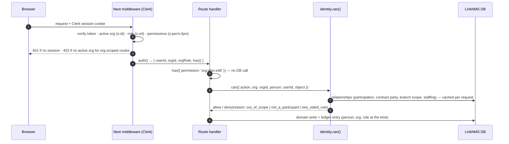

# 16 — Access model: RBAC in Clerk, relationships in LinkNMS

**Status:** Proposed (D-34). How authentication, organisation roles and permissions are anchored in
Clerk, and where Clerk stops. Rules of visibility and edit scope stay in
[04](./04-visibility-and-access.md) and [05 §12](./05-planning-and-execution.md); this document says
**which system holds which part of the decision**.

## 1. The principle: two questions, two systems

Every request answers two different questions:

| Question | Example | Nature | System of record |
|---|---|---|---|
| **What may this person do on behalf of their company?** | Can Inês (site lead at Douro) sign a contract? See prices? | Role-based, per organisation, changes rarely | **Clerk** (Organizations, roles, permissions) |
| **What is this company to this object?** | Is Douro a party to `ctr.sub.win`? Is T-400 inside Douro's scope? | Relationship-based, per project, changes all the time | **LinkNMS DB** (participation, contracts, branches, staffing) |

**Why not put everything in Clerk:** project-level relationships are data, not roles. They change with every
contract signed, number in the hundreds per GC, and would have to travel in a 4 KB session cookie that
carries **only the active organisation**. Clerk has no concept of "party to contract X" or "row inside
branch Y". Forcing it there means a sync job that is always slightly wrong, on a product whose promise
is that the record is right.

**Why not keep roles in our DB (as the as-is does):** today the RBAC catalogue is mirrored from Clerk
into Postgres (`users`, `orgs`, `roles`, `permissions`, `resource_acls` — LINA-142). That is two sources
of truth for the same fact. In the to-be, Clerk owns org roles and permissions outright; the DB only
mirrors identities for attribution.

The final decision is always the conjunction:

```
allow = clerk.permission(org role, action)          // may this person do this kind of thing for their company?
      ∧ linknms.relationship(org, object, action)   // is their company entitled to act on this object? (04, 05 §12)
      ∧ linknms.staffing(person, project)           // is this person working on this project? (admins: all)
      ∧ billing.entitled(org, capability)           // does the company's plan cover it? (07)
```

## 2. What lives in Clerk

| Concept | Clerk feature | Notes |
|---|---|---|
| Person, sign-in, MFA, sessions | Users, sessions | Source of truth. Email is unique. |
| LinkNMS organisation (household, GC, specialty, consultant) | **Organization** | Every organisation is a Clerk org, **including households**: a couple is two members of one org. |
| Organisation kind | Org `public_metadata.kind` + **Role Set** per kind | Small, so it does not bloat the token. The role set decides which roles an org can hand out. |
| Membership + role inside the company | Organization membership + role | One role per person per org (Clerk's model). |
| What a role may do for the company | **Custom permissions** `org:<feature>:<action>` | In the session token (`o.per` / `o.fpm`) → checked with `has({ permission })` without a DB call. |
| Acting organisation | **Active organization** | Replaces the `X-Org-Id` header ([11](./11-api-conventions.md)). A person in two orgs (an architect who is also building her own house) switches the active org. |
| Inviting colleagues into your company | Organization invitations | Clerk sends and tracks them. |
| Platform staff (LinkNMS support/admin) | User `public_metadata.platform_role` | Never a member of customer orgs. Read-only by default; every access is ledgered. |

Clerk constraints to design within (checked 2026-09-24):
- **At most 10 custom organisation roles per instance**; custom roles need the **B2B add-on** in production.
- **System permissions are not in session claims.** Every check that runs from the token must use a
  custom permission, so we define custom equivalents (e.g. `org:members:manage`).
- **Only the active organisation** is in the token.
- **Keep custom claims under ~1.2 KB** (the cookie limit is 4 KB). No project lists in metadata.

## 3. What stays in LinkNMS

- **Project participation, contracts (client / supplier), branch scope, staffing, assignees**: all
  relationships in [04](./04-visibility-and-access.md) and [05 §12](./05-planning-and-execution.md).
- **Project invitations**: an organisation invited onto a project, and RFP recipients by email.
  These are not Clerk invitations: an RFP recipient has no account yet and must not become a member of
  the issuer's org. When they accept, they sign up with Clerk, create their own org, and the link
  resolves to it.
- **The identity mirror** (`identity.person`, `identity.organization`, `identity.org_membership`),
  fed by Clerk webhooks (`user.*`, `organization.*`, `organizationMembership.*`). It exists for
  attribution and the ledger, which stores **person, org and role at the moment of the action**.
  It is never used to *decide* a permission.

## 4. Roles (7 of the 10 allowed)

| Role key | Who it is on a build | Available in role sets |
|---|---|---|
| `org:admin` | Company owner / managing partner; the homeowner | household, contractor, consultant |  |
| `org:manager` | Project/commercial manager: runs projects, tenders, signs | contractor, consultant |  |
| `org:representative` | Client's representative: a co-owner or a hired project manager acting for the owner | household |  |
| `org:site_lead` | Site manager / foreman (encarregado): runs execution, **no money** | contractor |  |
| `org:finance` | Accounting: measurements, payments, **no plan editing** | contractor, household |  |
| `org:member` | Crew / staff: reports progress on rows they are staffed on | contractor, consultant, household (read-mostly) |  |
| `org:inspector` | Independent quality inspector, external HSE technician: verifies, raises and closes non-conformities, records inspections | consultant |  |

Three slots stay free for later (e.g. `supplier_sales`).

**Role sets**
- `household`: admin, representative, finance, member
- `contractor` (GC and specialty alike: the *contract*, not the org type, decides GC vs sub): admin, manager, site_lead, finance, member
- `consultant` (architect, engineer, inspector, HSE): admin, manager, inspector, member

## 5. Permissions and the role matrix

Custom permissions (`org:<feature>:<action>`). They say what a person may do **for their company**.
The relationship check then decides **where**.

| Permission | admin | manager | representative | site_lead | finance | member | inspector |
|---|---|---|---|---|---|---|---|
| `org:projects:create` | ✓ | ✓ | ✓ | | | |  |
| `org:projects:staff` (put people on a project) | ✓ | ✓ | ✓ | | | |  |
| `org:plan:edit` (rows, dates, links, templates insert) | ✓ | ✓ | ✓ | ✓ | | |  |
| `org:progress:report` | ✓ | ✓ | ✓ | ✓ | | ✓ |  |
| `org:quality:verify` (accept/reject done work) | ✓ | ✓ | ✓ | ✓ | | | ✓ |
| `org:quality:inspect` (raise/close non-conformities, record inspections) | ✓ | ✓ | ✓ | ✓ | | | ✓ |
| `org:money:view` (prices, costs, margins, payments) | ✓ | ✓ | ✓ | | ✓ | |  |
| `org:costs:edit` (cost lines, BoQ) | ✓ | ✓ | | | | |  |
| `org:variations:acknowledge` | ✓ | ✓ | ✓ | | | |  |
| `org:changes:propose` / `org:changes:decide` (change orders) | ✓ | ✓ | ✓ | | | |  |
| `org:tendering:issue` (RFPs) | ✓ | ✓ | ✓ | | | |  |
| `org:tendering:bid` (proposals) | ✓ | ✓ | | | | |  |
| `org:contracts:sign` | ✓ | ✓ | ✓ *(if household policy allows)* | | | |  |
| `org:measurements:submit` / `:approve` | ✓ | ✓ | ✓ | | ✓ | |  |
| `org:payments:declare` / `:confirm` | ✓ | | ✓ | | ✓ | |  |
| `org:profile:manage` (directory, portfolio) | ✓ | ✓ | | | | |  |
| `org:reviews:write` | ✓ | ✓ | ✓ | | | |  |
| `org:templates:publish` (org / public) | ✓ | ✓ | | | | |  |
| `org:members:manage` (custom mirror of the system permission) | ✓ | | | | | |  |
| `org:billing:manage` | ✓ | | | | ✓ | |  |
| *everyone* | read the projects they are staffed on; comment; ask questions | | | | | | |

Two consequences worth stating:
- **`org:money:view` is a second confidentiality layer, inside a company.** The contract chain (V2)
  decides which *companies* see a price; this permission decides which *people* in that company do.
  A GC's foreman sees the plan but not the margin.
- **The API never sends money fields to a person without `org:money:view`**, even when their company
  is a party. It is enforced in the same projection that applies V2/V5.

## 6. Personas → org kind + role + relationship

Every persona variant, with links and interaction diagrams: [17](./17-personas-roles-interactions.md).

| Persona ([personas](../personas.md)) | Org kind | Clerk role | Relationship that scopes them (LinkNMS) |
|---|---|---|---|
| Owner | household | admin | `project.owner` — whole plan |
| Co-owner (couple) | household | admin or representative | same project, household approval policy |
| Client's representative (hired PM) | household | representative | same as owner, no billing, no member management |
| General contractor — boss | contractor | admin / manager | `contract.supplier` of the prime; client of subs |
| Site manager / foreman | contractor | site_lead | staffed on the project; branch scope of the org |
| Subcontractor | contractor | admin / manager / member | `contract.supplier` of a sub contract — own branch |
| Direct specialty | contractor | admin / manager / member | `contract.supplier` of a direct contract |
| Architect / engineer | consultant | admin / member | `service` contract or project invitation; assigned rows |
| Quality inspector / HSE | consultant | inspector | project invitation with capacity `inspection` / `safety`; verification and inspections |
| Supplier | *(future)* supplier | — | purchase orders do not exist yet ([07-open-questions](../07-open-questions.md) §7) |
| Licensing authority, neighbour | **no account** | — | scoped, expiring share links; never a Clerk user |

## 7. Request flow



Error mapping: missing Clerk permission → `403 forbidden` (`reason: role`), relationship → `403 out_of_scope`
/ `not_a_participant`, entitlement → `402 not_entitled` ([11](./11-api-conventions.md)).

## 8. Lifecycle events

| Event | Clerk | LinkNMS reaction (webhook) |
|---|---|---|
| Sign-up | user created | mirror person; ask "create your company or join one" |
| Create company / household | org created with `kind` + role set | mirror org; billing trial starts ([07](./07-marketplace-and-billing.md)) |
| Invite colleague | org invitation | mirror membership on acceptance |
| Change someone's role | membership updated | mirror; nothing else. Permissions change at the next token refresh (~60 s) |
| Remove someone from the company | membership deleted | remove project staffing; their past actions stay attributed in the ledger |
| Person leaves, company stays | — | contracts belong to the org, so nothing about the build changes |
| Delete an org with signed contracts | **blocked** by LinkNMS (webhook rejects, admin must close contracts first) | the record cannot lose a party |

## 9. Billing and Clerk

Clerk also offers Billing (plans and features checkable with `has({ plan })` / `has({ feature })`).
It would make entitlements as cheap to check as permissions. Before choosing it, verify **EUR, VAT and
Portuguese certified invoicing**: invoices to Portuguese companies must come from AT-certified
software. Until then the `billing.entitled()` port ([04 §4](./04-visibility-and-access.md)) hides the
choice between Clerk Billing and Stripe plus a certified PT invoicing tool.

## 10. What changes from the as-is

| As-is | To-be |
|---|---|
| `party` keyed by email; Clerk user joined on email | Person = Clerk user id; email kept for invitations only |
| In-DB RBAC catalogue mirrored from Clerk (`roles`, `permissions`, `resource_acls`) | **Deleted.** Clerk owns roles and permissions; the DB holds relationships only |
| `membership.role` owner/counterparty/subcontractor per project | Replaced by contract relationships + branch scope (04, 05 §12) |
| No active organisation; `party` is the actor | Clerk active org is the acting company |
| Seats by email (`identity.seat`, founding seats) | Seats = Clerk org members, limited by the org's plan |
