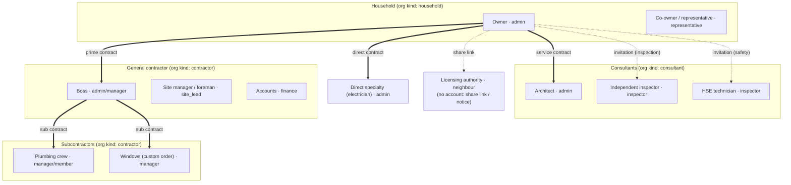
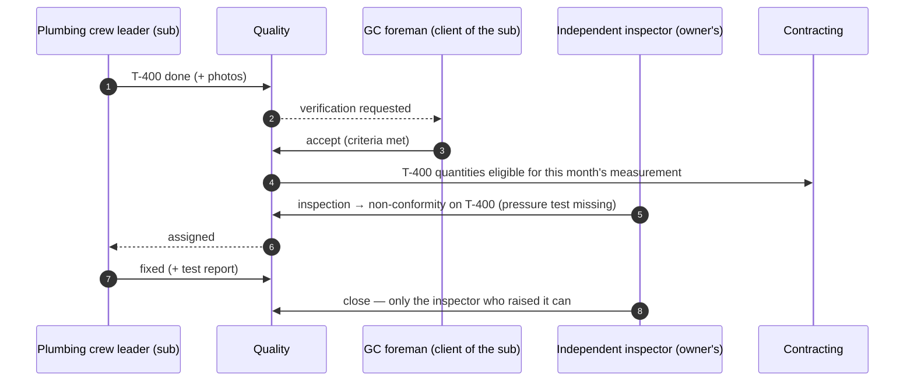
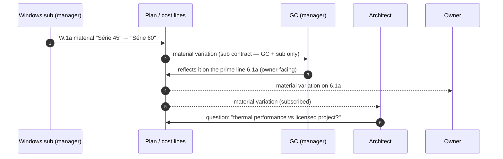

# 17 — Personas, roles and how the parties interact

Maps every persona variant in [`../personas/`](../personas/00-methodology.md) onto the access model:
**organisation kind → Clerk role → relationship on the build → what they can touch**, then shows how
the parties interact through the platform. Access rules: [04](./04-visibility-and-access.md),
[05 §12](./05-planning-and-execution.md), [16](./16-access-model-clerk.md).

Reading key:
- **Org kind / role**: what lives in Clerk ([16](./16-access-model-clerk.md)).
- **Joins the build by**: the relationship LinkNMS holds. `contract` = party to a contract;
  `invitation` = invited to the project without a priced contract; `staffing` = a person put on the
  project by their own company.
- **Edit scope**: where they can change the plan (D-33).
- **Money**: whether they see prices. That needs the company to be a party (V2) **and** the person to
  hold `org:money:view`.

## 1. The cast of one build



Thick arrows are **contracts**: they carry money, visibility of prices and edit scope. Dotted arrows
are **invitations**: presence on the build without a priced contract.

## 2. Persona variants → access

### Owner side

| Persona variant | Org kind · role | Joins by | Edit scope | Money | What the model gives them |
|---|---|---|---|---|---|
| [First-time owner](../personas/owner/01-first-time-owner.md) | household · `admin` | creates the project | whole plan | own contracts | The change view in plain language: one notification per 15 min with the net effect on end date and cost ("project end unchanged"), so a slip reads as information, not alarm. |
| [Experienced owner / investor](../personas/owner/02-experienced-owner-investor.md) | household (or company acting as owner) · `admin` | creates the project(s) | whole plan, several projects | own contracts | Portfolio across builds, variance tables, record export. Can staff a hired PM as `representative`. |
| [Couple / shared decision](../personas/owner/03-couple-shared-decision.md) | household · `admin` + `admin` (or `representative`) | same household org | whole plan | both see the same | Both get every notification; acknowledgements are per person, so "who saw it" is never ambiguous. Approval policy `any`/`all` on the household decides signatures and change orders ([14](./14-open-questions.md) Q3). |
| Client's representative (hired PM, family member) — [personas](../personas.md) | household · `representative` | member of the household org | whole plan | yes | Acts as the owner except billing and managing members. Whether they may sign is open ([14](./14-open-questions.md) Q16). |

### Builder side

| Persona variant | Org kind · role | Joins by | Edit scope | Money | What the model gives them |
|---|---|---|---|---|---|
| [Traditional master builder](../personas/contractor/01-traditional-master-builder.md) | contractor · `admin` (alone) | prime contract (award or direct entry) | prime branch incl. subs | yes | Lump-sum BoQ lines (`vg`) instead of detailed surveying; a starter template from the LinkNMS library; progress from the phone. |
| [Growing contractor](../personas/contractor/02-growing-contractor.md) | contractor · `admin` + `manager`s + `site_lead`s + `finance` | prime contracts on several projects | each prime branch | boss & finance yes; foremen **no** | Portfolio of builds; foremen staffed per project; `org:money:view` keeps margins away from site staff; org templates. |
| [Premium contractor](../personas/contractor/03-premium-contractor.md) | contractor · `admin`/`manager` | prime contract | prime branch | yes | Material and scope variations, drawn and notified to the owner **and the architect**, give the "whose decision, when" trail on spec changes. |
| [Volume / production contractor](../personas/contractor/04-volume-production-contractor.md) | contractor (often also owner-developer) · `admin`/`manager` | creates projects as owner **or** prime | whole plan when it is the owner | yes | Locations (units) inside one project, templates reused per house, batch insert. |
| [Field-promoted foreman](../personas/site-manager/01-field-foreman.md) | contractor · `site_lead` | staffed on the project by the GC | GC branch (via his org) | **no** | "My rows this week", report progress with a photo, raise non-conformities, verify subcontractors' work. No prices on his screen. |
| [Technical site manager](../personas/site-manager/02-technical-site-manager.md) | contractor · `site_lead` or `manager` | staffed | GC branch | `manager`: yes | Variance and health reports; as `manager` can also handle measurements. |

### Specialties

| Persona variant | Org kind · role | Joins by | Edit scope | Money | What the model gives them |
|---|---|---|---|---|---|
| [Independent tradesperson](../personas/subcontractor/01-independent-tradesperson.md) | contractor · `admin` (alone) | sub contract (GC) or direct contract (owner) | own branch only | own contract | Minimal loop: see his rows and dates, mark done + photo. Notified when a link moves his row. |
| [Small specialised crew](../personas/subcontractor/02-small-specialized-crew.md) | contractor · leader `manager`, crew `member` | sub or direct contract | own branch | leader yes, crew no | The leader reports for everyone; crew members can be staffed without seeing money. Links show exactly when the previous crew is due to leave. |
| [Rare-specialty subcontractor](../personas/subcontractor/03-rare-specialty-trade.md) | contractor · `admin` | sub or direct contract | own branch | own contract | Can refuse to use the tool: the **client above him (GC or owner) has his branch in scope**, so it can keep his rows up to date, attributed "reported by Douro". The record survives his absence. |

### Consultants and controllers

| Persona variant | Org kind · role | Joins by | Edit scope | Money | What the model gives them |
|---|---|---|---|---|---|
| [Engaged author architect](../personas/architect/01-engaged-author-architect.md) | consultant · `admin` | service contract with the owner | rows the owner assigns (design, licensing) | own fee | **Subscribed to scope and material variations** on the whole project, so he is informed at the moment of change, not after. Questions on rows. |
| [Permitting-only architect](../personas/architect/02-permitting-only-architect.md) | consultant · `admin` | invitation (or service contract) | assigned rows | own fee | "What changed since you last looked": the change view filtered by `since = last visit`. Short sessions on one problem. |
| [Formal independent inspector](../personas/quality-inspection/01-formal-independent-inspector.md) | consultant · `inspector` | invitation by the owner (capacity `inspection`) | none (does not edit the plan) | no | Verifies completed work on **any** row, raises non-conformities that **only he can close**, records inspections. Independent of the GC by construction. |
| [Informal inspection](../personas/quality-inspection/02-informal-inspection.md) | household · `admin`/`representative` | the owner | whole plan | yes | The owner verifies as the client at the top of the chain. The rule is the same; only the authority behind it is social, not contractual. |
| [External HSE technician](../personas/hse/01-external-hse-officer.md) | consultant · `inspector` | invitation (capacity `safety`) | none | no | Same mechanics as the inspector with safety criteria: inspections, safety non-conformities, dated photos, site-presence calendar (who is on site together). |
| [Informal safety lead](../personas/hse/02-informal-safety-lead.md) | contractor · `site_lead` | staffed | GC branch | no | Raises a safety non-conformity from the phone in two taps; no formal report required. |

### Outside the platform

| Persona variant | Access | Mechanism |
|---|---|---|
| [Big-box supplier](../personas/supplier/01-big-box-supplier.md) | none yet | Deliveries appear as milestones in the buyer's branch. Purchase orders do not exist ([07-open-questions](../07-open-questions.md) §7). |
| [Critical / custom-order supplier](../personas/supplier/02-critical-custom-order-supplier.md) | none yet | Its lead time is an `external` row linked into the plan; when purchase orders exist, a supplier org kind and role set get added. |
| Licensing authority | no account | Scoped, expiring share link to named documents and milestones. |
| Neighbour / condominium | no account | Occurrences recorded by the site team; outbound disruptive-work notices. |

## 3. Who interacts with whom, about what

| Between | About | Mechanism on the platform | Endpoint family ([12](./12-api-catalogue.md)) |
|---|---|---|---|
| Owner → GCs / specialties | Getting proposals | RFP from a subtree, one email per recipient | Tendering |
| GC → subcontractors | Getting proposals for part of its branch | Sub-level RFP from rows inside its branch | Tendering |
| Bidder ↔ issuer | Doubts about the package | Clarifications, with answers published to all bidders | Tendering |
| Owner ↔ GC · GC ↔ sub · owner ↔ direct | The agreement | Contract signed by both; the branch is baselined | Contracting |
| GC ↔ subs ↔ direct contractors | Sequence on site | **Links** between rows. A move by one pushes or pulls the other, and the moved row's assignee is notified | Planning |
| Any party → owner (and architect) | "Time / cost / material changed" | **Variation** drawn in clay + grouped notification | Planning (variations) |
| Owner → responsible party | "Why did this move?" | Acknowledge, and/or a **question** on the row, answered in place | Planning + Collaboration |
| Assignee → contract client | "It is done" | Progress `done` → verification request | Planning + Quality |
| Client / inspector → assignee | "Accepted" / "not accepted" | `verified`, or rejection with reason against acceptance criteria | Quality |
| Inspector / HSE → responsible party | "This is wrong / unsafe" | Non-conformity: assigned → fixed → **closed by whoever raised it** | Quality |
| Supplier (contract) → client | "This is what we did this month" | Measurement → approval → expected payment | Contracting |
| Client ↔ supplier (contract) | Money moved | Payment declared (client) → confirmed (supplier) | Contracting |
| Any two parties who worked together | Reputation | Reviews after the contract completes | Reputation |
| Everyone in a meeting | What was decided on site | Meeting minutes acknowledged by each org | Collaboration |

## 4. Three interactions, end to end

### a) A slip travels across three companies

```mermaid
sequenceDiagram
    autonumber
    participant SM as Foreman (GC · site_lead)
    participant P as Plan
    participant PL as Plumbing (sub · manager)
    participant EL as Electrician (direct · admin)
    participant OW as Owner (household · admin)
    participant AR as Architect (consultant)

    SM->>P: Alvenarias finish 08-28 → 09-11
    P->>P: link end→start pushes Canalização (+10 wd)<br/>link start→start +2 pushes Eletricidade (+10 wd)
    P-->>PL: "Your row moved: caused by Alvenarias (Douro)"
    P-->>EL: "Your row moved: caused by Canalização"
    P-->>OW: digest: 3 rows +10 wd · project end unchanged
    Note over AR: time only — architect not notified<br/>(subscribed to scope/material)
    OW->>P: acknowledge; question on Alvenarias "what caused it?"
    SM->>P: answer on the row (steel delivery, see T-130)
```

### b) Work done, checked by someone who is not the one who did it



### c) A spec change the architect must see before it happens



## 5. Rules this mapping adds or sharpens

1. **New role `org:inspector`** (consultant role set; 7 of Clerk's 10): verify, raise and close
   non-conformities, record inspections. No plan editing, no money. It covers the formal inspector and
   the external HSE technician. See [16](./16-access-model-clerk.md).
2. **Who may verify** (refines D-31): the organisations whose edit scope contains the row (the client
   chain up to the owner) **or** a consultant invited with capacity `inspection`/`safety`, and never
   the organisation that reported `done`. A subcontractor cannot verify the GC's work.
3. **Proxy reporting is a feature**: the client above a branch can report on it, attributed. This is how the
   rare-specialty and the independent tradesperson stay in the record without using the tool.
4. **Variation subscriptions per capacity**: owner → all kinds; contract client → its branches;
   architect → scope and material, project-wide; inspector/HSE → none by default.
5. **Non-conformity closure belongs to the raiser.** The GC cannot close what the inspector raised
   (as-is personas rule, kept).
6. **Site staff never see money by default**: `site_lead` and `member` lack `org:money:view`.
