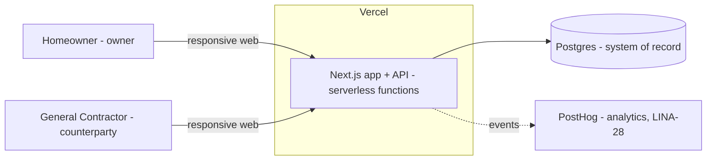
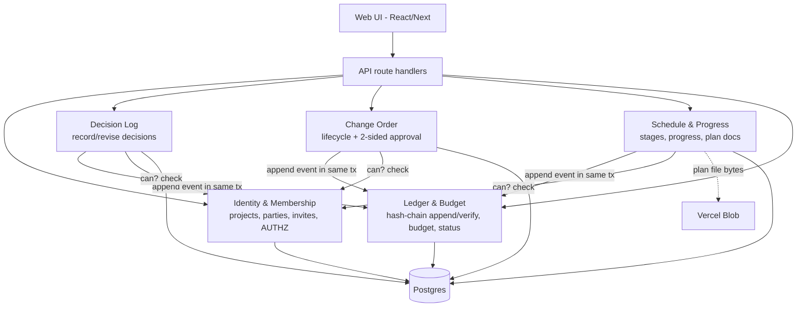
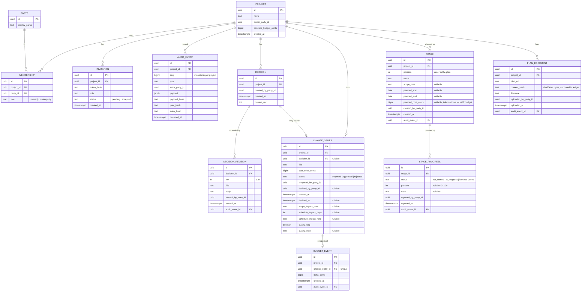
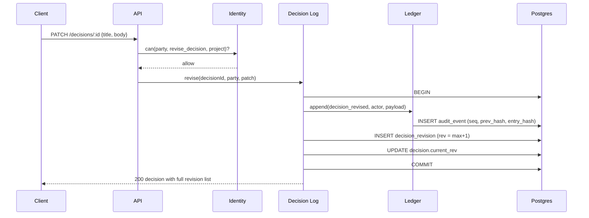
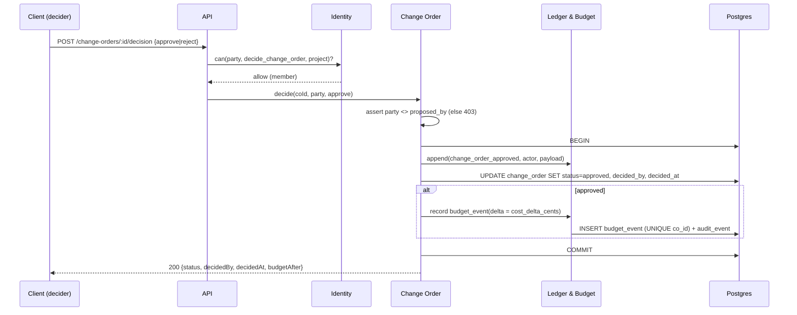

# R0 Technical Design — shared-record MVP

- **Status:** Proposed — awaiting CEO approval (LINA-26)
- **Owner:** Full-Stack Architect
- **Scope source of truth:** LINA-26 (PM), 9 functional requirements + acceptance.
- **Decisions behind this:** ADR-0001 (stack), ADR-0002 (ledger), ADR-0003
  (service boundaries), ADR-0004 (permissions), ADR-0005 (schedule/progress &
  plan documents — CEO scope expansion, 2026-08-25).

This is the document developers build against **after** CEO approval. It fixes
the data model, API contracts, the trust-critical flows, infra, rollout, and the
test strategy, and traces every functional requirement to a design element.

---

## 1. System context (C4 level 1)

One responsive web app, two human roles, one Postgres system of record. Analytics
(PostHog) is instrumented per LINA-28 but is not on the trust path.

## 2. Service decomposition (C4 level 2)

Five bounded services (ADR-0003 + ADR-0005), one deployable in R0, extractable
later.

**Golden rule:** `audit_event` is written **only** by Ledger & Budget, always in
the same DB transaction as the caller's projection write. Every mutation is
authorized by Identity & Membership first. Schedule & Progress follows the exact
same discipline (ADR-0005): stage/progress/plan-doc changes are ledgered events,
and stage cost is a **planned allocation only** — it never moves the budget.

## 3. Data model

The ledger is the truth; the rest are rebuildable projections (ADR-0002).

### Integrity rules baked into the schema

- **Money is integer cents** everywhere — never floats.
- `audit_event`: `UNIQUE(project_id, seq)`, `UNIQUE(project_id, entry_hash)`; DB
  role has **INSERT + SELECT only** (ADR-0002 §4).
- `decision_revision`: `UNIQUE(decision_id, rev)`; rev 1 is the original,
  amendments append rev 2..n. Nothing is ever overwritten.
- `change_order`: `CHECK (decided_by_party_id IS NULL OR decided_by_party_id <>
  proposed_by_party_id)` — the FR4 two-sided rule, enforced in the database.
- `budget_event`: `UNIQUE(change_order_id)` — a CO can move the budget **once**,
  ever. Only `cost_delta_cents` flows here; scope/schedule/quality never do.
- `membership`: `UNIQUE(project_id, role)` in R0 — exactly one owner, one
  counterparty.
- `stage.planned_cost_cents` is **informational allocation only** — it is never
  read by the budget calculation (ADR-0005 §3). No `budget_event` is ever
  written from a stage. `UNIQUE(project_id, position)` keeps stage order stable.
- `stage_progress` is append-only: each report is a new row with its own author
  + timestamp; the current status is the latest row, prior reports are never
  overwritten (same discipline as `decision_revision`).
- `plan_document.content_hash` is the SHA-256 of the uploaded bytes, carried into
  the `plan_document_uploaded` ledger event so the plan-of-record is provable
  even though the file lives in Vercel Blob (ADR-0005 §4).

## 4. Trust-critical flows (UML sequence)

### 4.1 Revise a decision — history is never lost (FR2)

The original stays as rev 1; the edit is rev 2 with its own author + timestamp,
and the ledger event chains it. No `UPDATE` ever touches a prior revision.

### 4.2 Two-sided change-order approval + budget move (FR4, FR5)

The proposer-≠-decider rule is checked in code **and** by a DB `CHECK`. The
budget only moves inside this transaction, only on approve, exactly once.

## 5. Budget & four-pillar status (FR5, FR8, FR9)

- **Current budget** `= baseline + Σ(cost_delta_cents of budget_event rows)`.
  Because a `budget_event` exists **iff** its CO is approved, proposed/rejected
  COs cannot move the total. Each approved CO's contribution is its own
  `budget_event` row (FR5 "individual contribution visible").
- **Four-pillar status** is derived (Ledger & Budget), colour **plus** label +
  icon (never colour alone — FR9 accessibility):

  | Pillar | Signal | Rule |
  |--------|--------|------|
  | **Cost** | quantified | green if current ≤ baseline; amber if over by ≤ threshold%; red if over beyond it. Always shows the number. |
  | **Time** | schedule-impact days | `Σ schedule_impact_days on approved COs`. Green when 0; else "changes added ~N days". **Never** claims on-track-vs-baseline (we hold no schedule baseline in R0). |
  | **Scope** | qualitative | amber if any open (proposed) CO carries a scope note; green if none. |
  | **Quality** | qualitative | amber/red if any approved CO has `quality_flag`; green if none. |

  Scope/schedule/quality are recorded for transparency and **never** change the
  budget total (FR8).

## 6. API contract (R0, versioned `/api/v1`)

Auth: session cookie from an invite/magic-link; the acting party is derived
server-side (never from the body). All money is integer cents. Errors are
`{ error: { code, message } }` with proper HTTP status.

| Method & path | Auth | Purpose | Key body / returns |
|---------------|------|---------|--------------------|
| `POST /projects` | owner (self) | Start a shared record (FR1) | `{name, baselineBudgetCents}` → project |
| `GET /projects/:id` | member | Project + memberships + budget summary | → project, currentBudget, pillars |
| `POST /projects/:id/invitations` | owner | Invite the one GC (FR1) | `{role:"counterparty"}` → invite token |
| `POST /invitations/:token/accept` | invitee | GC joins | → membership |
| `GET /projects/:id/decisions` | member | Full decision history, chronological (FR7) | → decisions[] with revisions |
| `POST /projects/:id/decisions` | member | Record a decision (FR2) | `{title, body}` → decision |
| `PATCH /decisions/:id` | member | Revise (append rev, FR2) | `{title, body}` → decision + revisions |
| `GET /projects/:id/change-orders` | member | All COs, chronological (FR7) | → change orders[] |
| `POST /projects/:id/change-orders` | member | Raise CO, opens *proposed* (FR3, FR8) | `{title, costDeltaCents, decisionId?, scopeImpactNote?, scheduleImpactDays?, scheduleImpactNote?, qualityFlag?, qualityNote?}` |
| `POST /change-orders/:id/decision` | member ≠ proposer | Approve/reject (FR4) | `{decision:"approve"\|"reject"}` → status, decidedBy, decidedAt, budgetAfter |
| `GET /change-orders/:id` | member | The "one screen" answer (FR6) | → who decided, when, cost delta, budget before/after |
| `GET /projects/:id/audit` | member | Full ledger + **chain-verify result** | → events[] in `seq` order, `{ verified: true\|firstBrokenSeq }` |
| `GET /projects/:id/plan` | member | The plan timeline: stages + latest progress + plan doc (ADR-0005) | → stages[] ordered by `position` with latest progress, plan document meta |
| `POST /projects/:id/stages` | GC | Add a stage (ADR-0005 §5) | `{name, scopeNote?, plannedStart?, plannedEnd?, plannedCostCents?}` → stage |
| `PATCH /stages/:id` | GC | Update stage fields (append ledger event) | `{name?, scopeNote?, plannedStart?, plannedEnd?, plannedCostCents?, position?}` → stage |
| `POST /stages/:id/progress` | GC | Record progress (append-only, FR-attributable) | `{status, percent?, note?}` → progress |
| `POST /projects/:id/plan-document` | GC | Upload the construction plan file to Blob, hash-anchored | multipart `file` → `{blobUrl, contentHash}` |

## 7. Frontend surfaces (build against LINA-27 mockups)

Responsive, mobile-first, on-site-friendly. Colour never the only signal.

- **Project dashboard** — four-pillar status panel (FR9), current budget vs
  baseline, entry points to decisions and change orders.
- **Decision log** — chronological list; "edited" badge opens the revision
  history with authors + timestamps (FR2, FR7).
- **Change orders** — list with status; raise form; a CO detail that *is* the
  "one screen" answer: who decided, when, cost impact, budget before→after
  (FR6), plus the scope/schedule/quality captured notes (FR8).
- **Plan timeline** — the GC's staged construction plan (ADR-0005): stages in
  order with dates, scope note, planned cost, and current progress (status +
  optional %). The GC edits; the homeowner views. Planned cost is shown as an
  allocation, clearly distinct from the authoritative budget total. The uploaded
  plan document is downloadable, with its integrity (content hash) verifiable.
- **Audit view** — the ledger in order with a visible "integrity: verified"
  state (the tamper-evidence made tangible), covering decisions, change orders,
  **and** plan/progress events.

Final visual design comes from **LINA-27** (Product Designer). Engineering builds
against those mockups; this doc fixes behaviour and data, not pixels.

## 8. Functional-requirement traceability

| FR | Requirement | Where satisfied |
|----|-------------|-----------------|
| FR1 | Start a record, baseline, invite one GC | `POST /projects`, invitations; `membership UNIQUE(project,role)` |
| FR2 | Decisions stick; tamper-evident; corrections keep history | Decision Log append-only + `decision_revision`; ledger chain (ADR-0002); §4.1 |
| FR3 | Raise CO with cost impact, opens *proposed* | `POST /change-orders`; status default `proposed` |
| FR4 | Approve/reject only by non-proposer (or owner) | ADR-0004; code assert + DB `CHECK (decided_by <> proposed_by)`; §4.2 |
| FR5 | Budget = baseline + Σ approved; each contribution visible; proposed/rejected never move it | §5; `budget_event` iff approved, `UNIQUE(co_id)` |
| FR6 | One screen: who/when/how much | `GET /change-orders/:id`; §7 CO detail |
| FR7 | Full history in order | `GET .../decisions`, `.../change-orders`, `.../audit` ordered by `created_at`/`seq` |
| FR8 | Capture scope/schedule/quality; never change budget | CO fields; §5 rules; excluded from budget math |
| FR9 | Four-pillar green/amber/red + label + icon; Time never claims vs baseline | §5 status table; colour+label+icon |
| Acceptance | Immutability of authorship/approval provably holds | ADR-0002 hash chain + chain-verify tests; DB grants; §9 |
| Plan/Progress (CEO scope, 2026-08-25) | GC enters/uploads plan; homeowner sees stages w/ dates·scope·cost·progress | ADR-0005; Schedule & Progress service; `stage`/`stage_progress`/`plan_document`; §7 plan timeline. **Functional detail pending PM re-plan** — design seam is ready, exact stage/progress semantics are PM-owned (ADR-0005 open questions). |

## 9. Test & verification strategy

The trust anchor gets adversarial tests, not just happy-path.

- **Ledger integrity:** append N events, verify chain; then simulate tampering
  (mutate a payload / delete a middle event at the DB level in a test) and assert
  chain-verify reports the exact first broken `seq`. Canonical-JSON stability
  tests (key order, number formatting) so verify has no false positives.
- **Two-sided approval:** proposer cannot approve or reject their own CO (403);
  the owner-is-proposer edge case requires the counterparty to decide; DB `CHECK`
  rejects a forged `decided_by = proposed_by` even if code is bypassed.
- **Budget math:** proposed/rejected COs never move the total; approving moves it
  exactly once; double-approve is a no-op (idempotent, `UNIQUE(co_id)`).
- **Decision history:** a revision never overwrites rev 1; author + timestamp of
  each rev preserved.
- **Permissions:** non-members get 403; only owner invites/creates.
- **Integration/E2E:** the full FR1→FR9 story for a homeowner + one GC through
  the API, then through the UI against LINA-27 mockups.
- **CI:** run on Vercel preview per PR; migrations apply cleanly forward.

## 10. Infrastructure & operations

- **Hosting:** Vercel (production + preview per PR). Next.js app + serverless API.
- **Database:** Vercel Postgres / Neon; **one instance, one Postgres schema per
  service** (`identity`, `decision`, `change_order`, `ledger`, `schedule`), with
  ownership enforced by **per-service DB roles and grants** — not just discipline
  (ADR-0006 §1). A `migrator` role owns all DDL; app roles get `USAGE` on their
  own schema only. `audit_event` is write-guarded: appends go through
  `ledger.append_event(...)` (`SECURITY DEFINER`), so hash-chain construction
  lives in one place and no role holds raw INSERT/UPDATE/DELETE on it (ADR-0002
  §4). Trust-critical writes commit the projection + the ledger append in one
  cross-schema transaction on a single instance; the split-DB seam is a
  per-schema transactional outbox (ADR-0006 §1), noted not built.
- **Connectivity & scaling:** a **connection pooler is mandatory** under
  serverless (Neon/PgBouncer, transaction-mode) to avoid connection storms.
  Derived reads (budget, four-pillar status, chain-verify) are cached with short
  TTL + **invalidation on ledger append**; the audit read carries an `ETag` =
  head `entry_hash` for cheap `304`s; mutations are never cached; per-party rate
  limits protect shared paths (ADR-0006 §3).
- **API visibility:** each service publishes an **OpenAPI 3.1** doc it owns
  (`services/<name>/openapi.yaml`), rendered with **Swagger UI** (free) at
  `/api/docs` on preview only; internal interfaces are documented and
  contract-tested against the specs (ADR-0006 §2).
- **Migrations:** SQL files in-repo, forward-only, applied in CI before deploy.
- **Secrets:** Vercel env vars only — never committed. `.env` stays git-ignored.
- **Backups:** managed Postgres PITR; a nightly chain-verify job over every
  project's ledger, alerting on any broken link.
- **Observability:** structured request logs; PostHog product events (LINA-28);
  an internal `/audit` integrity signal surfaced in-app. **Every endpoint emits
  operational metrics** (latency p50/p95/p99, error rate, throughput, status-code
  mix) tagged by `service` + `route` via OpenTelemetry, so degradation is
  attributable to one service. **SLOs (R0):** reads p95 < 200 ms, mutations p95 <
  500 ms, chain-verify p95 < 1 s, error rate < 1%. The **Product Analytics Lead
  owns the endpoint-SLA dashboard + alerting** (delegated, extends LINA-28); a
  sustained breach alerts the owning service and the CEO (ADR-0006 §4).
- **Environments:** `preview` (per PR) → `production`. No production deploy or
  public release without explicit CEO approval (per my boundaries).

## 11. Risks, trade-offs, tech debt (explicit)

- **Shared Postgres, not separate service DBs** (ADR-0001/0003): accepted for R0
  velocity + transactional correctness; extraction seams defined. Revisit at 3rd
  party type / multi-house.
- **Canonical-JSON discipline** is load-bearing for verification; mitigated by a
  single shared serializer + tests. A drift here is a correctness bug, treated as
  such.
- **Auth is lightweight** (invite/magic-link) in R0; the permission *model* is
  the durable part. Full IdP is future work.
- **No external notarization yet:** internal hash chain only. Publishing the head
  hash externally is a noted future seam, not built.
- **Plan file lives off the relational transaction** (Vercel Blob, ADR-0005):
  the ledger's content-hash — not a foreign key — ties a file to a point in time.
  Orphaned blobs (uploaded, never committed) are swept later; out of R0 scope.
- **Stage planned cost vs authoritative budget** (ADR-0005 §3): two cost numbers
  now exist (plan allocation, ledger total). Mitigated by keeping stage cost
  structurally out of the budget calc and labelling it as an allocation in the UI.

## 12. Rollout / delivery plan (post-approval)

Thin vertical slices, each shippable, in dependency order. On CEO approval I
decompose these into delegated implementation child issues for the developers
(I build the hardest core — the ledger — and review the rest):

1. **Slice 0 — Skeleton & data layer:** Next.js on Vercel, Postgres, migrations,
   two DB roles, CI with preview deploys.
2. **Slice 1 — Ledger core (Architect-owned):** `audit_event` append + hash
   chain + chain-verify + adversarial tests. Nothing else lands until this is
   green — it's the trust anchor.
3. **Slice 2 — Identity & Membership:** projects, baseline, invite one GC,
   authorization interface.
4. **Slice 3 — Decision Log:** record + revise (append-only) over the ledger.
5. **Slice 4 — Change Orders + Budget:** lifecycle, two-sided approval, budget
   events, the "one screen" answer.
6. **Slice 5 — Four-pillar status + audit view + FR polish**, against LINA-27
   mockups, instrumented per LINA-28.
7. **Slice 6 — Schedule & Progress (ADR-0005):** stages + append-only progress
   over the ledger, plan-document upload to Blob with hash anchoring, and the
   plan-timeline surface. Sequenced after the trust core so plan/progress reuse
   the proven ledger discipline. **Depends on the PM's functional detailing of
   the expanded scope** (ADR-0005 open questions) before its child issues open.

Acceptance = all 9 FRs demonstrably true end-to-end for a homeowner + one GC,
with immutability provably holding.
